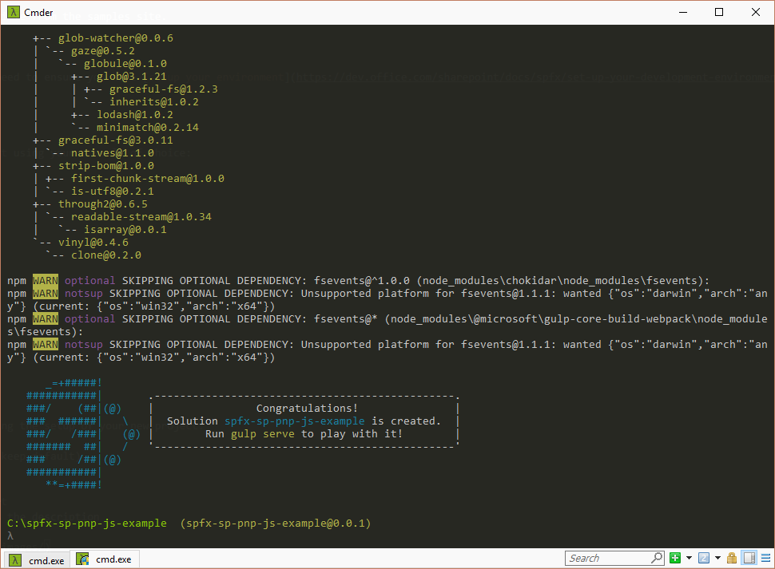
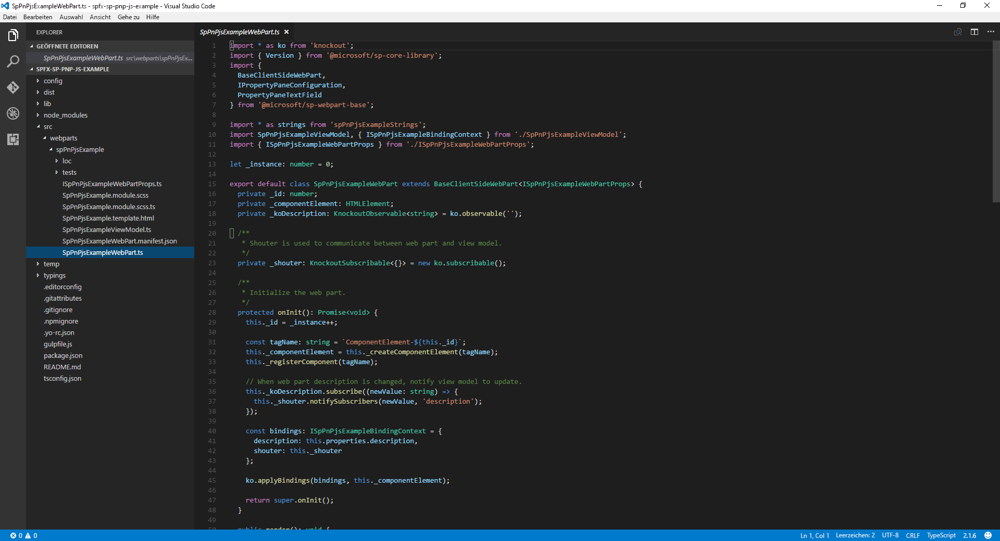
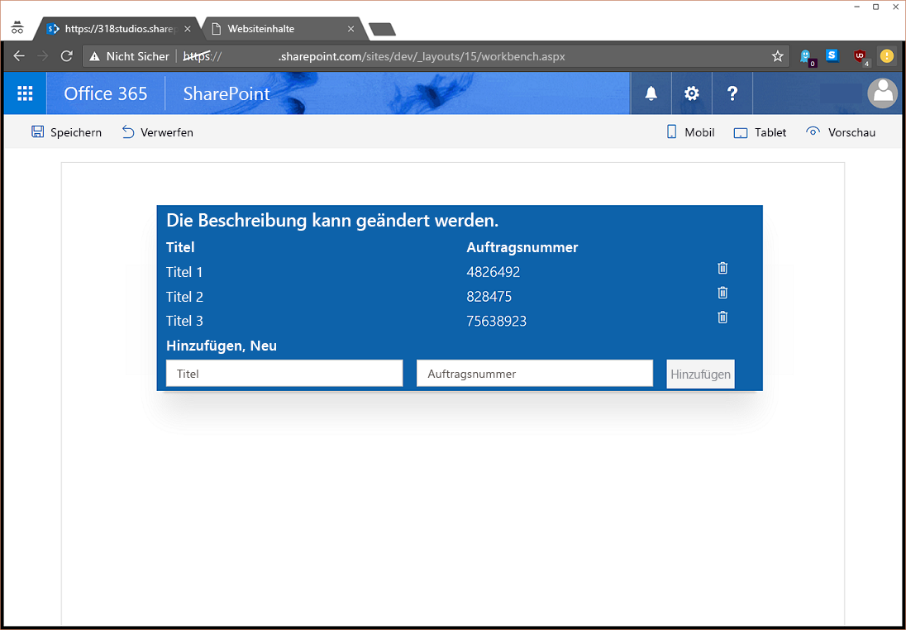

# <a name="use-sp-pnp-js-with-sharepoint-framework-web-parts"></a>Verwenden von sp-pnp-js mit SharePoint Framework-Webparts

Sie können wählen, ob Sie die [sp-pnp-js](https://www.npmjs.com/package/sp-pnp-js)-Bibliothek beim Erstellen Ihrer SharePoint Framework-Webparts (SPFx) verwenden möchten. Diese Bibliothek bietet eine Fluent-API, um die Erstellung Ihrer REST-Abfragen intuitiv zu gestalten und die Batchverarbeitung und die Zwischenspeicherung zu unterstützen. Erfahren Sie mehr auf der [Projekt-Homepage](https://github.com/SharePoint/PnP-JS-Core), die Links zu Dokumentation, Beispielen und weiteren Ressourcen bieten, die Ihnen die ersten Schritte erleichtern.

Sie können die [vollständige Quelle](https://github.com/SharePoint/sp-dev-fx-webparts/tree/master/samples/knockout-sp-pnp-js) für diesen Artikel von der Beispielwebsite herunterladen.

## <a name="setup-your-environment"></a>Einrichten der Umgebung

Bevor Sie diesen Leitfaden abschließen können, müssen Sie sicherzustellen, dass Sie [die Umgebung](https://dev.office.com/sharepoint/docs/spfx/set-up-your-development-environment) für die Entwicklung mit SharePoint Framework eingerichtet haben.

## <a name="create-a-new-project"></a>Erstellen eines neuen Projekts

Erstellen Sie zunächst einen neuen Ordners für das Projekt über eine Konsole Ihrer Wahl:

```sh
md spfx-sp-pnp-js-example
```

Geben Sie diesen Ordner ein:

```sh
cd spfx-sp-pnp-js-example
```

Führen Sie dann den Yeoman-Generator für SPFx aus:

```sh
yo @microsoft/sharepoint
```

Geben Sie die folgenden Werte ein, sobald Sie während der Einrichtung des neuen Projekts dazu aufgefordert werden:

- **spfx-sp-pnp-js-example** als Lösungsname (Standardwert beibehalten)
- **Aktueller Ordner** als Speicherort der Lösung
- **Kockout** als Framework
- **SPPnPJSExample** als Name des Webparts
- **Beispiel zur Verwendung von sp-pnp-js in SPFx** als Beschreibung




Nachdem der Bau des Gerüsts abgeschlossen wurde, öffnen Sie das Projekt im Code-Editor Ihrer Wahl. Die hier dargestellten Screenshots verwenden [Visual Studio Code](https://code.visualstudio.com/). Um das Verzeichnis in Visual Studio Code zu öffnen, geben Sie an der Konsole Folgendes ein:

```sh
code .
```



## <a name="install-and-setup-sp-pnp-js"></a>Installieren und Einrichten von sp-pnp-js

Nachdem Sie das Projekt erstellt haben, müssen Sie sp-pnp-js, beginnend mit der Installation des Pakets, installieren und einrichten. Diese Schritte gelten für alle Projekttypen (React usw.).

```sh
npm install sp-pnp-js --save
```

Da die sp-pnp-js-Bibliothek REST-Anforderungen erstellt, muss sie die URL kennen, um diese Anforderung senden zu können. Bei der Arbeit mit herkömmlichen Websites und Webseiten kann die globale `_spPageContextInfo`-Variable verwendet werden. In SPFx ist diese nicht verfügbar bzw. ist möglicherweise nicht richtig. Daher wird das vom Framework bereitgestellte [context](https://dev.office.com/sharepoint/reference/spfx/sp-webpart-base/iwebpartcontext)-Objekt verwendet. Es gibt [zwei Möglichkeiten](https://github.com/SharePoint/PnP-JS-Core/wiki/Using-sp-pnp-js-in-SharePoint-Framework#establish-context), um sicherzustellen, dass Sie Ihre Anforderungen korrekt eingerichtet haben. In diesem Beispiel verwenden wir die `onInit`-Methode.

### <a name="update-oninit-in-sppnpjsexamplewebpartts"></a>Aktualisieren von onInit in SpPnPjsExampleWebPart.ts

Öffnen Sie die Datei **src\webparts\spPnPjsExample\SpPnPjsExampleWebPart.ts**, und fügen Sie eine Importanweisung für das pnp-Stammobjekt hinzu:

```TypeScript
import pnp from "sp-pnp-js";
```

Aktualisieren Sie den Code in der `onInit`-Methode wie unten dargestellt. Der Block wird nach dem `super.onInit()`-Aufruf hinzugefügt. Dies geschieht nach `super.onInit`, um sicherzustellen, dass das Framework alles Erforderliche initialisieren kann, und dass die Bibliothek nach diesen Schritten eingerichtet werden kann.

```TypeScript
/**
 * Initialize the web part.
 */
protected onInit(): Promise<void> {
  this._id = _instance++;

  const tagName: string = `ComponentElement-${this._id}`;
  this._componentElement = this._createComponentElement(tagName);
  this._registerComponent(tagName);

  // When the web part description is changed, notify the view model to update.
  this._koDescription.subscribe((newValue: string) => {
    this._shouter.notifySubscribers(newValue, 'description');
  });

  const bindings: ISpPnPjsExampleBindingContext = {
    description: this.properties.description,
    shouter: this._shouter
  };

  ko.applyBindings(bindings, this._componentElement);

  return super.onInit().then(_ => {
    pnp.setup({
      spfxContext: this.context
    });
  });
}
```

## <a name="update-the-viewmodel"></a>Aktualisieren von ViewModel

Als Nächstes ersetzen Sie den Inhalt der Datei **SpPnPjsExampleViewModel.ts** durch den unten aufgeführten Code. Wir fügen eine Importanweisung für die pnp-Elemente, eine Schnittstelle zum Definieren der Elementfelder, einige Objekte des Typs „Observable“ zum Verfolgen der Elementliste und der neuen Elementform sowie schließlich Methoden, die das Abrufen, Hinzufügen und Löschen von Elementen unterstützen, hinzu. Wir haben außerdem eine `ensureList`-Methode hinzugefügt, die die sp-pnp-js `lists.ensure`-Methode verwendet, um stets sicherzustellen, dass wir die Liste haben (oder sie bei Bedarf zu erstellen). Es gibt viele Möglichkeiten, Ressourcen bereitzustellen; diese Methode wurde jedoch ausgewählt, um zu zeigen, wie eine Liste, ein Feld und Elemente mithilfe der Batchverarbeitung in einer einzigen Methode erstellt werden.

Festzuhalten ist, dass durch die Verwendung von sp-pnp-js weniger Code zur Verarbeitung der Anforderungen zu schreiben ist und mehr Zeit für die Geschäftslogik bleibt.

```TypeScript
import * as ko from 'knockout';
import styles from './SpPnPjsExample.module.scss';
import { ISpPnPjsExampleWebPartProps } from './ISpPnPjsExampleWebPartProps';
import pnp, { List, ListEnsureResult, ItemAddResult } from "sp-pnp-js";

export interface ISpPnPjsExampleBindingContext extends ISpPnPjsExampleWebPartProps {
  shouter: KnockoutSubscribable<{}>;
}

/**
 * Interface which defines the fields in our list items
 */
export interface OrderListItem {
  Id: number;
  Title: string;
  OrderNumber: string;
}

export default class SpPnPjsExampleViewModel {

  public description: KnockoutObservable<string> = ko.observable('');
  public newItemTitle: KnockoutObservable<string> = ko.observable('');
  public newItemNumber: KnockoutObservable<string> = ko.observable('');
  public items: KnockoutObservableArray<OrderListItem> = ko.observableArray([]);

  public labelClass: string = styles.label;
  public helloWorldClass: string = styles.helloWorld;
  public containerClass: string = styles.container;
  public rowClass: string = `ms-Grid-row ms-bgColor-themeDark ms-fontColor-white ${styles.row}`;
  public buttonClass: string = `ms-Button ${styles.button}`;

  constructor(bindings: ISpPnPjsExampleBindingContext) {
    this.description(bindings.description);

    // When the web part description is updated, change this view model's description.
    bindings.shouter.subscribe((value: string) => {
      this.description(value);
    }, this, 'description');

    // Load the items
    this.getItems().then(items => {

      this.items(items);
    });
  }

  /**
   * Gets the items from the list
   */
  private getItems(): Promise<OrderListItem[]> {

    return this.ensureList().then(list => {

      // Here we are using the getAs operator so that our returned value will be typed
      return list.items.select("Id", "Title", "OrderNumber").getAs<OrderListItem[]>();
    });
  }

  /**
   * Adds an item to the list
   */
  public addItem(): void {

    if (this.newItemTitle() !== "" && this.newItemNumber() !== "") {

      this.ensureList().then(list => {

        // Add the new item to the SharePoint list
        list.items.add({
          Title: this.newItemTitle(),
          OrderNumber: this.newItemNumber(),
        }).then((iar: ItemAddResult) => {

          // Add the new item to the display
          this.items.push({
            Id: iar.data.Id,
            OrderNumber: iar.data.OrderNumber,
            Title: iar.data.Title,
          });

          // Clear the form
          this.newItemTitle("");
          this.newItemNumber("");
        });
      });
    }
  }

  /**
   * Deletes an item from the list
   */
  public deleteItem(data): void {

    if (confirm("Are you sure you want to delete this item?")) {
      this.ensureList().then(list => {
        list.items.getById(data.Id).delete().then(_ => {
          this.items.remove(data);
        });
      }).catch((e: Error) => {
        alert(`There was an error deleting the item: ${e.message}`);
      });
    }
  }

  /**
   * Ensures the list exists. If not, it creates it and adds some default example data
   */
  private ensureList(): Promise<List> {

    return new Promise<List>((resolve, reject) => {

      // Use lists.ensure to always have the list available
      pnp.sp.web.lists.ensure("SPPnPJSExampleList").then((ler: ListEnsureResult) => {

        if (ler.created) {

          // We created the list on this call, so let's add a column
          ler.list.fields.addText("OrderNumber").then(_ => {

            // And we will also add a few items so we can see some example data
            // Here we use batching

            // Create a batch
            let batch = pnp.sp.web.createBatch();

            ler.list.getListItemEntityTypeFullName().then(typeName => {

              ler.list.items.inBatch(batch).add({
                Title: "Title 1",
                OrderNumber: "4826492"
              }, typeName);

              ler.list.items.inBatch(batch).add({
                Title: "Title 2",
                OrderNumber: "828475"
              }, typeName);

              ler.list.items.inBatch(batch).add({
                Title: "Title 3",
                OrderNumber: "75638923"
              }, typeName);

              // Excute the batched operations
              batch.execute().then(_ => {
                // All of the items have been added within the batch

                resolve(ler.list);

              }).catch(e => reject(e));

            }).catch(e => reject(e));

          }).catch(e => reject(e));

        } else {

          resolve(ler.list);
        }

      }).catch(e => reject(e));
    });
  }
}
```
## <a name="update-the-template"></a>Aktualisieren der Vorlage

Schließlich müssen wir die Vorlage aktualisieren, um sie der Funktionalität anzupassen, die wir dem ViewModel hinzugefügt haben. Kopieren Sie den unten aufgeführten Code die Datei **SpPnPjsExample.template.html**. Wir haben eine Titelzeile sowie einen ForEach-Repeater für die Elementauflistung und ein Formular hinzugefügt, mit dem Sie neue Elemente zur Liste hinzufügen können.

```html
<div data-bind="attr: {class:helloWorldClass}">
  <div data-bind="attr: {class:containerClass}">

    <div data-bind="attr: {class:rowClass}">
      <div class="ms-Grid-col ms-u-sm12">
        <span class="ms-font-xl ms-fontColor-white ms-fontWeight-semibold" data-bind="text: description"></span>
      </div>
    </div>

    <div data-bind="attr: {class:rowClass}">
      <div class="ms-Grid-col ms-u-sm6">
        <span class="ms-font-l ms-fontColor-white ms-fontWeight-semibold">Title</span>
      </div>
      <div class="ms-Grid-col  ms-u-sm6">
        <span class="ms-font-l ms-fontColor-white ms-fontWeight-semibold">Order Number</span>
      </div>
    </div>

    <!-- ko foreach: items -->
    <div data-bind="attr: {class:$parent.rowClass}">
      <div class="ms-Grid-col ms-u-sm6">
        <span class="ms-font-l ms-fontColor-white" data-bind="text: Title"></span>
      </div>
      <div class="ms-Grid-col  ms-u-sm5">
        <span class="ms-font-l ms-fontColor-white" data-bind="text: OrderNumber"></span>
      </div>
      <div class="ms-Grid-col  ms-u-sm1">
        <i class="ms-Icon ms-Icon--Delete" aria-hidden="true" data-bind="click: $parent.deleteItem.bind($parent, $data)"></i>
      </div>
    </div>
    <!-- /ko -->

    <div data-bind="attr: {class:rowClass}">
      <div class="ms-Grid-col  ms-u-sm12">
        <span class="ms-font-l ms-fontColor-white ms-fontWeight-semibold">Add New</span>
      </div>
    </div>

    <div data-bind="attr: {class:rowClass}">
      <form data-bind="submit: addItem">
        <div class="ms-Grid-col ms-u-sm5">
          <input class="ms-TextField-field" placeholder="Title" data-bind='value: newItemTitle, valueUpdate: "afterkeydown"' />
        </div>
        <div class="ms-Grid-col ms-u-sm5">
          <input class="ms-TextField-field" placeholder="Order Number" data-bind='value: newItemNumber, valueUpdate: "afterkeydown"'
          />
        </div>
        <div class="ms-Grid-col ms-u-sm2">
          <button class="ms-Button--default ms-Button" type="submit" data-bind="enable: newItemTitle().length > 0 && newItemNumber().length > 0"><span class="ms-Button-label">Add</span></button>
        </div>
      </form>
    </div>

  </div>
</div>
```
## <a name="run-the-example"></a>Ausführen des Beispiels

Starten Sie das Beispiel, und fügen Sie das Webpart zu Ihrer in SharePoint gehosteten Workbench (/_layouts/workbench.aspx) hinzu, um es in Aktion sehen zu können.

```sh
gulp serve --nobrowser
```



Sie können vorhandene Elemente löschen, indem Sie auf das Papierkorbsymbol klicken, oder neue Elemente hinzufügen, indem Sie Werte in beide Felder eingeben und auf die Schaltfläche „Hinzufügen“ klicken.

## <a name="next-steps"></a>Nächste Schritte

Die sp-pnp-js-Bibliothek enthält eine große Palette an Funktionen und Erweiterungsoptionen. Im [Leitfaden für Entwickler](https://github.com/SharePoint/PnP-JS-Core/wiki/Developer-Guide) finden Sie Beispiele, Anleitungen und Tipps zur Verwendung und Konfiguration der Bibliothek.

## <a name="production-deployment"></a>Bereitstellung in der Produktion

Wenn Sie Ihre Lösung bereitstellen und mithilfe der Kennzeichnung `--ship` erstellen möchten, müssen Sie sp-pnp-js als externe Bibliothek in der Konfiguration markieren. Dies geschieht durch Aktualisierung der SPFx-Datei **config/config.js**, um diese Zeile in den Extern-Abschnitt einzuschließen:

```
"sp-pnp-js": "https://cdnjs.cloudflare.com/ajax/libs/sp-pnp-js/2.0.1/pnp.min.js"
```

In der oben aufgeführten Konfiguration verwenden wir das öffentliche CDN. Die URL kann jedoch auch ein interner Pfad oder ein anderer Speicherort sein, den Sie verwenden möchten. Achten Sie jedoch darauf, dass Sie die Versionsnummer in der URL so aktualisieren, dass sie mit der Zielversion übereinstimmt.

## <a name="improving-the-example---mock-data"></a>Verbessern des Beispiels - simulierte Daten

Idealerweise funktioniert das Beispiel sowohl in der lokalen als auch in der von SharePoint gehosteten Workbench. Zur Aktivierung müssen wir das ViewModel simulieren und den Webpartcode, wie unten dargestellt, aktualisieren.

### <a name="mock-viewmodel"></a>Simuliertes ViewModel

Fügen Sie eine neue Datei mit dem Namen **MockSpPnPjsExampleViewModel.ts** zusammen mit den anderen Webpartdateien hinzu. Aktualisieren Sie dann den Inhalt dieser Datei mit dem unten aufgeführten Code. Damit erhalten Sie den gleichen Satz an Funktionen, ohne dass SharePoint verfügbar sein muss, und es funktioniert in der lokalen Umgebung.

```TypeScript
import * as ko from 'knockout';
import styles from './SpPnPjsExample.module.scss';
import { ISpPnPjsExampleWebPartProps } from './ISpPnPjsExampleWebPartProps';
import pnp, { List, ListEnsureResult, ItemAddResult } from "sp-pnp-js";
import { ISpPnPjsExampleBindingContext, OrderListItem } from './SpPnPjsExampleViewModel';

export default class MockSpPnPjsExampleViewModel {

    public description: KnockoutObservable<string> = ko.observable('');
    public newItemTitle: KnockoutObservable<string> = ko.observable('');
    public newItemNumber: KnockoutObservable<string> = ko.observable('');
    public items: KnockoutObservableArray<OrderListItem> = ko.observableArray([]);

    public labelClass: string = styles.label;
    public helloWorldClass: string = styles.helloWorld;
    public containerClass: string = styles.container;
    public rowClass: string = `ms-Grid-row ms-bgColor-themeDark ms-fontColor-white ${styles.row}`;
    public buttonClass: string = `ms-Button ${styles.button}`;

    constructor(bindings: ISpPnPjsExampleBindingContext) {
        this.description(bindings.description);

        // When the web part description is updated, change this view model's description.
        bindings.shouter.subscribe((value: string) => {
            this.description(value);
        }, this, 'description');

        // Load the items
        this.getItems().then(items => {

            this.items(items);
        });
    }

    /**
     * Simulates getting the items from the list
     */
    private getItems(): Promise<OrderListItem[]> {
        return Promise.resolve([{
            Id: 1,
            Title: "Mock Item 1",
            OrderNumber: "12345"
        },
        {
            Id: 2,
            Title: "Mock Item 2",
            OrderNumber: "12345"
        },
        {
            Id: 3,
            Title: "Mock Item 3",
            OrderNumber: "12345"
        }]);
    }

    /**
     * Simulates adding an item to the list
     */
    public addItem(): void {

        if (this.newItemTitle() !== "" && this.newItemNumber() !== "") {

            // Add the new item to the display
            this.items.push({
                Id: this.items.length,
                OrderNumber: this.newItemNumber(),
                Title: this.newItemTitle(),
            });

            // Clear the form
            this.newItemTitle("");
            this.newItemNumber("");
        }
    }

    /**
     * Simulates deleting an item from the list
     */
    public deleteItem(data): void {

        if (confirm("Are you sure you want to delete this item?")) {
            this.items.remove(data);
        }
    }
}
```
### <a name="update-webpart"></a>Aktualisieren des Webparts

Abschließend muss das Webpart aktualisiert werden, um die simulierten Daten bei Bedarf verwenden zu können. Öffnen Sie die Datei **SpPnPjsExampleWebPart.ts**. Importieren Sie dann das simulierte ViewModell-Web, das Sie gerade erstellt haben.

```TypeScript
import MockSpPnPjsExampleViewModel from './MockSpPnPjsExampleViewModel';
```
Suchen Sie anschließend die `_registerComponent`-Methode, und aktualisieren Sie diese wie unten dargestellt:

```TypeScript
private _registerComponent(tagName: string): void {

  if (Environment.type === EnvironmentType.Local) {
    console.log("here I am.")
    ko.components.register(
      tagName,
      {
        viewModel: MockSpPnPjsExampleViewModel,
        template: require('./SpPnPjsExample.template.html'),
        synchronous: false
      }
    );
  } else {
    ko.components.register(
      tagName,
      {
        viewModel: SpPnPjsExampleViewModel,
        template: require('./SpPnPjsExample.template.html'),
        synchronous: false
      }
    );
  }
}
```
Geben Sie dann `gulp serve` in der Konsole ein, um die lokale Workbench aufzurufen, die jetzt die simulierten Daten verwendet. (Falls der Server bereits ausgeführt wird, halten Sie ihn mit STRG+C an, und starten Sie ihn dann erneut.)

```sh
gulp serve
```


## <a name="download-full-example-code"></a>Herunterladen des vollständigen Beispielcodes

Zur Erinnerung: Sie finden Sie das vollständige Beispiel [hier](https://github.com/SharePoint/sp-dev-fx-webparts/tree/master/samples/knockout-sp-pnp-js).

## <a name="provide-feedback--report-issues"></a>Geben Sie Feedback/Melden Sie Probleme

Wenn Sie uns Ihr Feedback senden oder ein Problem mit sp-pnp-js melden möchten, verwenden Sie die [Problemliste](https://github.com/SharePoint/PnP-JS-Core/issues) in diesem Bericht.
