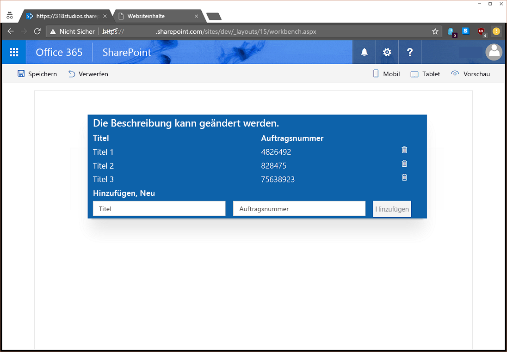

# <a name="use-sp-pnp-js-with-sharepoint-framework-web-parts"></a>Verwenden von sp-pnp-js mit SharePoint-Framework-Webparts

Sie können wählen, ob Sie die [sp pnp Js](https://www.npmjs.com/package/sp-pnp-js)-Bibliothek beim Erstellen Ihrer SharePoint-Framework-Webparts verwenden möchten. Diese Bibliothek bietet eine Fluent-API, um die Erstellung Ihrer REST-Abfragen intuitiv zu gestalten und die Batchverarbeitung und die Zwischenspeicherung zu unterstützen. Weitere Informationen finden Sie auf der [Projekt-Homepage](https://github.com/SharePoint/PnP-JS-Core), die Links zu Dokumentation, Beispielen und weiteren Ressourcen bieten, die Ihnen die ersten Schritte erleichtern.

Sie können die [vollständige Quelle](https://github.com/SharePoint/sp-dev-fx-webparts/tree/master/samples/knockout-sp-pnp-js) für diesen Artikel von der Beispielwebsite herunterladen.

> [!NOTE] 
> Bevor Sie die Schritte in diesem Artikel ausführen, müssen Sie [die Entwicklungsumgebung für Ihr clientseitiges SharePoint-Webpart einrichten](../../set-up-your-development-environment.md).

## <a name="create-a-new-project"></a>Erstellen eines neuen Projekts

1. Erstellen Sie über eine Konsole Ihrer Wahl einen neuen Ordner für das Projekt:

  ```sh
  md spfx-sp-pnp-js-example
  ```

2. Geben Sie diesen Ordner ein:

  ```sh
  cd spfx-sp-pnp-js-example
  ```

3. Führen Sie den Yeoman-Generator für SPFx aus:

  ```sh
  yo @microsoft/sharepoint
  ```

4. Geben Sie die folgenden Werte ein, sobald Sie während der Einrichtung des neuen Projekts dazu aufgefordert werden:

  - **spfx-sp-pnp-js-example** als Lösungsname (Standardwert beibehalten)
  - **SharePoint Online only (latest)** als Basispaketversion.
  - **Aktueller Ordner** als Speicherort der Lösung
  - **Y**, um dem Mandantenadministrator die Bereitstellung der Lösung für alle Websites zu ermöglichen
  - **WebPart** als die zu erstellende Komponente
  - **SPPnPJSExample** als Name des Webparts
  - **Beispiel zur Verwendung von sp-pnp-js in SPFx** als Beschreibung
  - **Knockout** als Framework

  

5. Sobald das Gerüst abgeschlossen ist, sperren Sie die Version der Projektabhängigkeiten, indem Sie den folgenden Befehl ausführen:

  ```sh
  npm shrinkwrap
  ```

6. Öffnen Sie das Projekt im beliebigen Code-Editor. Die hier aufgeführten Screenshots stellen [Visual Studio Code](https://code.visualstudio.com/) dar. Um das Verzeichnis in Visual Studio Code zu öffnen, geben Sie Folgendes in der Konsole ein:

  ```sh
  code .
  ```

  

## <a name="install-and-set-up-sp-pnp-js"></a>Installieren und Einrichten von sp-pnp-js

Nachdem Sie das Projekt erstellt haben, müssen Sie sp-pnp-js, beginnend mit der Installation des Pakets, installieren und einrichten. Diese Schritte gelten für alle Projekttypen (React usw.).

```sh
npm install sp-pnp-js --save
```

Da die sp-pnp-js-Bibliothek REST-Anforderungen erstellt, muss sie die URL kennen, um diese Anforderung senden zu können. Bei der Arbeit mit herkömmlichen Websites und Webseiten kann die globale `_spPageContextInfo`-Variable verwendet werden. In SPFx ist diese nicht verfügbar bzw. ist möglicherweise nicht richtig. Daher wird das vom Framework bereitgestellte [context](https://docs.microsoft.com/en-us/javascript/api/sp-webpart-base/webpartcontext)-Objekt verwendet. 

 Es gibt [zwei Möglichkeiten](https://github.com/SharePoint/PnP-JS-Core/wiki/Using-sp-pnp-js-in-SharePoint-Framework#establish-context), um sicherzustellen, dass Sie Ihre Anforderungen korrekt eingerichtet haben. In diesem Beispiel verwenden wir die `onInit`-Methode.

### <a name="update-oninit-in-sppnpjsexamplewebpartts"></a>Aktualisieren von onInit in SpPnPjsExampleWebPart.ts

1. Öffnen Sie die Datei **src\webparts\spPnPjsExample\SpPnPjsExampleWebPart.ts**, und fügen Sie eine Importanweisung für das pnp-Stammobjekt hinzu:

  ```TypeScript
  import pnp from "sp-pnp-js";
  ```

2. Aktualisieren Sie den Code in der `onInit`-Methode wie unten dargestellt. Der Block wird nach dem `super.onInit()`-Aufruf hinzugefügt. Dies geschieht nach `super.onInit`, um sicherzustellen, dass das Framework alles Erforderliche initialisieren kann, und dass die Bibliothek nach diesen Schritten eingerichtet werden kann.

  ```TypeScript
  /**
  * Initialize the web part.
  */
  protected onInit(): Promise<void> {
    this._id = _instance++;

    const tagName: string = `ComponentElement-${this._id}`;
    this._componentElement = this._createComponentElement(tagName);
    this._registerComponent(tagName);

    // When the web part description is changed, notify the view model to update.
    this._koDescription.subscribe((newValue: string) => {
      this._shouter.notifySubscribers(newValue, 'description');
    });

    const bindings: ISpPnPjsExampleBindingContext = {
      description: this.properties.description,
      shouter: this._shouter
    };

    ko.applyBindings(bindings, this._componentElement);

    return super.onInit().then(_ => {
      pnp.setup({
        spfxContext: this.context
      });
    });
  }
  ```

## <a name="update-the-viewmodel"></a>Aktualisieren von ViewModel

Ersetzen Sie dann den Inhalt der Datei **SpPnPjsExampleViewModel.ts** durch den folgenden Code. Wir haben eine Importanweisung für die pnp-Elemente, eine Schnittstelle zum Definieren der Felder unserer Listenelemente, einige Objekte des Typs „Observable“, um die Elementliste und die neue Elementform zu verfolgen, sowie Methoden hinzugefügt, um das Abrufen, Hinzufügen und Löschen von Elementen zu unterstützen. 

Außerdem wurde eine `ensureList`-Methode hinzugefügt, die die `lists.ensure`-Methode von sp-pnp-js verwendet, um immer sicherzustellen, dass  die Liste vorhanden ist (und diese falls nötig zu erstellen). Es gibt viele Möglichkeiten, Ressourcen bereitzustellen, hier wurde aber gezeigt, wie eine Liste, ein Feld und Elemente mithilfe der Batchverarbeitung in einer einzigen Methode erstellt werden.

Festzuhalten ist, dass durch die Verwendung von sp-pnp-js weniger Code zur Verarbeitung der Anforderungen zu schreiben ist und mehr Zeit für die Geschäftslogik bleibt.

```TypeScript
import * as ko from 'knockout';
import styles from './SpPnPjsExample.module.scss';
import { ISpPnPjsExampleWebPartProps } from './SpPnPjsExampleWebPart';
import pnp, { List, ListEnsureResult, ItemAddResult, FieldAddResult } from "sp-pnp-js";

export interface ISpPnPjsExampleBindingContext extends ISpPnPjsExampleWebPartProps {
  shouter: KnockoutSubscribable<{}>;
}

/**
 * Interface which defines the fields in our list items
 */
export interface OrderListItem {
  Id: number;
  Title: string;
  OrderNumber: string;
}

const LIST_EXISTS: string = 'List exists';

export default class SpPnPjsExampleViewModel {
  public description: KnockoutObservable<string> = ko.observable('');
  public newItemTitle: KnockoutObservable<string> = ko.observable('');
  public newItemNumber: KnockoutObservable<string> = ko.observable('');
  public items: KnockoutObservableArray<OrderListItem> = ko.observableArray([]);

  public labelClass: string = styles.label;
  public spPnPjsExampleClass: string = styles.spPnPjsExample;
  public containerClass: string = styles.container;
  public rowClass: string = `ms-Grid-row ms-bgColor-themeDark ms-fontColor-white ${styles.row}`;
  public buttonClass: string = `ms-Button ${styles.button}`;

  constructor(bindings: ISpPnPjsExampleBindingContext) {
    this.description(bindings.description);

    // When the web part description is updated, change this view model's description.
    bindings.shouter.subscribe((value: string) => {
      this.description(value);
    }, this, 'description');

    // Load the items
    this.getItems().then((items: OrderListItem[]): void => {
      this.items(items);
    });
  }

  /**
   * Gets the items from the list
   */
  private getItems(): Promise<OrderListItem[]> {
    return this.ensureList().then((list: List): Promise<OrderListItem[]> => {
      // Here we are using the getAs operator so that our returned value will be typed
      return list.items.select("Id", "Title", "OrderNumber").getAs<OrderListItem[]>();
    });
  }

  /**
   * Adds an item to the list
   */
  public addItem(): void {
    if (this.newItemTitle() !== "" && this.newItemNumber() !== "") {
      this.ensureList().then((list: List): Promise<ItemAddResult> => {
        // Add the new item to the SharePoint list
        return list.items.add({
          Title: this.newItemTitle(),
          OrderNumber: this.newItemNumber(),
        });
      }).then((iar: ItemAddResult) => {
        // Add the new item to the display
        this.items.push({
          Id: iar.data.Id,
          OrderNumber: iar.data.OrderNumber,
          Title: iar.data.Title,
        });

        // Clear the form
        this.newItemTitle("");
        this.newItemNumber("");
      });
    }
  }

  /**
   * Deletes an item from the list
   */
  public deleteItem(data): void {
    if (!confirm("Are you sure you want to delete this item?")) {
      return;
    }

    this.ensureList().then((list: List): Promise<void> => {
      return list.items.getById(data.Id).delete();
    }).then(_ => {
      this.items.remove(data);
    }).catch((e: Error) => {
      alert(`There was an error deleting the item: ${e.message}`);
    });
  }

  /**
   * Ensures the list exists. If not, it creates it and adds some default example data
   */
  private ensureList(): Promise<List> {
    return new Promise<List>((resolve: (list: List) => void, reject: (err: string) => void): void => {
      let listEnsureResults: ListEnsureResult;
      // Use lists.ensure to always have the list available
      pnp.sp.web.lists.ensure("SPPnPJSExampleList")
        .then((ler: ListEnsureResult): Promise<FieldAddResult> => {
          listEnsureResults = ler;

          if (!ler.created) {
             // resolve main promise
            resolve(ler.list);
            // break promise chain
            return Promise.reject(LIST_EXISTS);
          }

          // We created the list on this call, so let's add a column
          return ler.list.fields.addText("OrderNumber");
        }).then((): Promise<string> => {
          console.warn('Adding items...');
          // And we will also add a few items so we can see some example data
          // Here we use batching
          return listEnsureResults.list.getListItemEntityTypeFullName();
        }).then((typeName: string): Promise<void> => {
          // Create a batch
          const batch = pnp.sp.web.createBatch();
          listEnsureResults.list.items.inBatch(batch).add({
            Title: "Title 1",
            OrderNumber: "4826492"
          }, typeName);

          listEnsureResults.list.items.inBatch(batch).add({
            Title: "Title 2",
            OrderNumber: "828475"
          }, typeName);

          listEnsureResults.list.items.inBatch(batch).add({
            Title: "Title 3",
            OrderNumber: "75638923"
          }, typeName);

          // Execute the batched operations
          return batch.execute();
        }).then((): void => {
          // All of the items have been added within the batch
          resolve(listEnsureResults.list);
        }).catch((e: any): void => {
          if (e !== LIST_EXISTS) {
            reject(e);
          }
        });
    });
  }
}
```

## <a name="update-the-template"></a>Aktualisieren der Vorlage

Schließlich müssen wir die Vorlage aktualisieren, um sie der Funktionalität anzupassen, die wir dem ViewModel hinzugefügt haben. Kopieren Sie den unten stehenden Code in die Datei **SpPnPjsExample.template.html**. Wir haben eine Titelzeile sowie auch einen `foreach`-Repeater für die Elementauflistung und ein Formular hinzugefügt, mit dem Sie neue Elemente zur Liste hinzufügen können.

```html
<div data-bind="attr: {class:spPnPjsExampleClass}">
  <div data-bind="attr: {class:containerClass}">

    <div data-bind="attr: {class:rowClass}">
      <div class="ms-Grid-col ms-u-sm12">
        <span class="ms-font-xl ms-fontColor-white ms-fontWeight-semibold" data-bind="text: description"></span>
      </div>
    </div>

    <div data-bind="attr: {class:rowClass}">
      <div class="ms-Grid-col ms-u-sm6">
        <span class="ms-font-l ms-fontColor-white ms-fontWeight-semibold">Title</span>
      </div>
      <div class="ms-Grid-col  ms-u-sm6">
        <span class="ms-font-l ms-fontColor-white ms-fontWeight-semibold">Order Number</span>
      </div>
    </div>

    <!-- ko foreach: items -->
    <div data-bind="attr: {class:$parent.rowClass}">
      <div class="ms-Grid-col ms-u-sm6">
        <span class="ms-font-l ms-fontColor-white" data-bind="text: Title"></span>
      </div>
      <div class="ms-Grid-col  ms-u-sm5">
        <span class="ms-font-l ms-fontColor-white" data-bind="text: OrderNumber"></span>
      </div>
      <div class="ms-Grid-col  ms-u-sm1">
        <i class="ms-Icon ms-Icon--Delete" aria-hidden="true" data-bind="click: $parent.deleteItem.bind($parent, $data)"></i>
      </div>
    </div>
    <!-- /ko -->

    <div data-bind="attr: {class:rowClass}">
      <div class="ms-Grid-col  ms-u-sm12">
        <span class="ms-font-l ms-fontColor-white ms-fontWeight-semibold">Add New</span>
      </div>
    </div>

    <div data-bind="attr: {class:rowClass}">
      <form data-bind="submit: addItem">
        <div class="ms-Grid-col ms-u-sm5">
          <input class="ms-TextField-field" placeholder="Title" data-bind='value: newItemTitle, valueUpdate: "afterkeydown"' />
        </div>
        <div class="ms-Grid-col ms-u-sm5">
          <input class="ms-TextField-field" placeholder="Order Number" data-bind='value: newItemNumber, valueUpdate: "afterkeydown"'
          />
        </div>
        <div class="ms-Grid-col ms-u-sm2">
          <button class="ms-Button--default ms-Button" type="submit" data-bind="enable: newItemTitle().length > 0 && newItemNumber().length > 0"><span class="ms-Button-label">Add</span></button>
        </div>
      </form>
    </div>

  </div>
</div>
```

## <a name="run-the-example"></a>Ausführen des Beispiels

Starten Sie das Beispiel, und fügen Sie das Webpart zu Ihrer in SharePoint gehosteten Workbench (/_layouts/workbench.aspx) hinzu, um es in Aktion sehen zu können.

```sh
gulp serve --nobrowser
```

<br/>

Sie können vorhandene Elemente löschen, indem Sie auf das Papierkorbsymbol klicken, oder neue Elemente hinzufügen, indem Sie Werte in beide Felder eingeben und auf die Schaltfläche **Hinzufügen** klicken.




### <a name="next-steps"></a>Nächste Schritte

Die sp-pnp-js-Bibliothek enthält eine große Palette an Funktionen und Erweiterungsoptionen. Im [Leitfaden für Entwickler](https://github.com/SharePoint/PnP-JS-Core/wiki/Developer-Guide) finden Sie Beispiele, Anleitungen und Tipps zur Verwendung und Konfiguration der Bibliothek. 

## <a name="deploy-to-production"></a>Bereitstellen für die Produktion

Wenn Sie Ihre Lösung bereitstellen und mithilfe der `--ship`-Kennzeichnung versehen möchten, müssen Sie sp-pnp-js als extern in der Konfiguration markieren. Dies geschieht durch Aktualisierung der SPFx-Datei **config/config.js**, um diese Zeile in den Abschnitt extern einzuschließen:

```json
"sp-pnp-js": "https://cdnjs.cloudflare.com/ajax/libs/sp-pnp-js/2.0.1/pnp.min.js"
```

In dieser Konfiguration verwenden wir das öffentliche CDN, die URL kann aber ein interner Pfad oder ein anderer beliebiger Speicherort sein, den Sie verwenden möchten. Aktualisieren Sie aber unbedingt die Versionsnummer in der URL, damit sie der gewünschten Version entspricht.

## <a name="improve-the-mock-data-example"></a>Verbessern des Beispiels - simulierte Daten

Idealerweise funktioniert das Beispiel sowohl auf der lokalen als auch auf der gehosteten SharePoint-Workbench. Zur Aktivierung müssen wir das ViewModel simulieren und den Webpartcode, wie in den folgenden Abschnitten dargestellt, aktualisieren.

### <a name="add-mock-viewmodel-file"></a>Hinzufügen einer simulierten ViewModel-Datei

Fügen Sie eine neue Datei namens **MockSpPnPjsExampleViewModel.ts** zusammen mit den anderen Webpartdateien hinzu. Aktualisieren Sie dann den Inhalt dieser Datei mithilfe des folgenden Codes. Damit erhalten Sie den gleichen Satz an Funktionen, ohne dass SharePoint verfügbar sein muss, und es funktioniert in der lokalen Umgebung.

```TypeScript
import * as ko from 'knockout';
import styles from './SpPnPjsExample.module.scss';
import { ISpPnPjsExampleWebPartProps } from './SpPnPjsExampleWebPart';
import pnp, { List, ListEnsureResult, ItemAddResult } from "sp-pnp-js";
import { ISpPnPjsExampleBindingContext, OrderListItem } from './SpPnPjsExampleViewModel';

export default class MockSpPnPjsExampleViewModel {

    public description: KnockoutObservable<string> = ko.observable('');
    public newItemTitle: KnockoutObservable<string> = ko.observable('');
    public newItemNumber: KnockoutObservable<string> = ko.observable('');
    public items: KnockoutObservableArray<OrderListItem> = ko.observableArray([]);

    public labelClass: string = styles.label;
    public spPnPjsExampleClass: string = styles.spPnPjsExample;
    public containerClass: string = styles.container;
    public rowClass: string = `ms-Grid-row ms-bgColor-themeDark ms-fontColor-white ${styles.row}`;
    public buttonClass: string = `ms-Button ${styles.button}`;

    constructor(bindings: ISpPnPjsExampleBindingContext) {
        this.description(bindings.description);

        // When the web part description is updated, change this view model's description.
        bindings.shouter.subscribe((value: string): void => {
            this.description(value);
        }, this, 'description');

        // Load the items
        this.getItems().then((items: OrderListItem[]): void => {
            this.items(items);
        });
    }

    /**
     * Simulates getting the items from the list
     */
    private getItems(): Promise<OrderListItem[]> {
        return Promise.resolve([{
            Id: 1,
            Title: "Mock Item 1",
            OrderNumber: "12345"
        },
        {
            Id: 2,
            Title: "Mock Item 2",
            OrderNumber: "12345"
        },
        {
            Id: 3,
            Title: "Mock Item 3",
            OrderNumber: "12345"
        }]);
    }

    /**
     * Simulates adding an item to the list
     */
    public addItem(): void {
        if (this.newItemTitle() !== "" && this.newItemNumber() !== "") {
            // Add the new item to the display
            this.items.push({
                Id: this.items.length,
                OrderNumber: this.newItemNumber(),
                Title: this.newItemTitle(),
            });

            // Clear the form
            this.newItemTitle("");
            this.newItemNumber("");
        }
    }

    /**
     * Simulates deleting an item from the list
     */
    public deleteItem(data): void {
        if (confirm("Are you sure you want to delete this item?")) {
            this.items.remove(data);
        }
    }
}
```

### <a name="update-web-part"></a>Aktualisieren des Webparts

Schließlich muss das Webpart so aktualisiert werden, dass es ggf. simulierte Daten verwendet. 

1. Öffnen Sie die Datei **SpPnPjsExampleWebPart.ts**, und importieren Sie das soeben erstellte simulierte ViewModel:

  ```TypeScript
  import MockSpPnPjsExampleViewModel from './MockSpPnPjsExampleViewModel';
  ```

2. IIportieren Sie die Typen `Environment` und `EnvironmentType`, die Sie zum Erkennen des Umgebungstyps des Webparts verwenden möchten, die ausgeführt werden in:

  ```TypeScript
  import { Environment, EnvironmentType } from '@microsoft/sp-core-library';
  ```

3. Suchen Sie die `_registerComponent`-Methode, und aktualisieren Sie diese wie unten dargestellt:

  ```TypeScript
  private _registerComponent(tagName: string): void {
    ko.components.register(
      tagName,
      {
        viewModel: Environment.type === EnvironmentType.Local ?
          MockSpPnPjsExampleViewModel :
          SpPnPjsExampleViewModel,
        template: require('./SpPnPjsExample.template.html'),
        synchronous: false
      }
    );
  }
  ```

4. Geben Sie `gulp serve` auf der Konsole ein, um die lokale Workbench anzuzeigen, die jetzt mit den simulierten Daten arbeitet. (Falls der Server bereits ausgeführt wird, halten Sie ihn mit STRG + C an, und starten Sie ihn dann erneut):

  ```sh
  gulp serve
  ```

  <br/>

  


## <a name="see-also"></a>Siehe auch

- [Herunterladen des vollständigen Beispiels](https://github.com/SharePoint/sp-dev-fx-webparts/tree/master/samples/knockout-sp-pnp-js)
- [Geben Sie Feedback/Melden Sie Probleme](https://github.com/SharePoint/PnP-JS-Core/issues)
- [SharePoint Framework-Übersicht](../../sharepoint-framework-overview.md)
