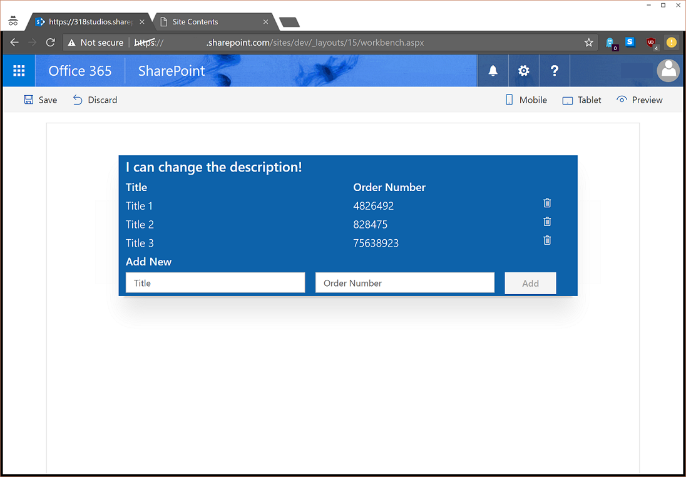

# <a name="use-sp-pnp-js-with-sharepoint-framework-web-parts"></a><span data-ttu-id="ebfed-103">Verwenden von sp-pnp-js mit SharePoint-Framework-Webparts</span><span class="sxs-lookup"><span data-stu-id="ebfed-103">Use sp-pnp-js with SharePoint Framework Web Parts</span></span>

<span data-ttu-id="ebfed-104">Sie können wählen, ob Sie die [sp pnp Js](https://www.npmjs.com/package/sp-pnp-js)-Bibliothek beim Erstellen Ihrer SharePoint-Framework-Webparts verwenden möchten.</span><span class="sxs-lookup"><span data-stu-id="ebfed-104">You may choose to use the [sp-pnp-js](https://www.npmjs.com/package/sp-pnp-js) library when building your SharePoint Framework (SPFx) web parts.</span></span> <span data-ttu-id="ebfed-105">Diese Bibliothek bietet eine Fluent-API, um die Erstellung Ihrer REST-Abfragen intuitiv zu gestalten und die Batchverarbeitung und die Zwischenspeicherung zu unterstützen.</span><span class="sxs-lookup"><span data-stu-id="ebfed-105">This library provides a fluent API to make building your REST queries intuitive and supports batching and caching.</span></span> <span data-ttu-id="ebfed-106">Weitere Informationen finden Sie auf der [Projekt-Homepage](https://github.com/SharePoint/PnP-JS-Core), die Links zu Dokumentation, Beispielen und weiteren Ressourcen bieten, die Ihnen die ersten Schritte erleichtern.</span><span class="sxs-lookup"><span data-stu-id="ebfed-106">For more information, see the [project's homepage](https://github.com/SharePoint/PnP-JS-Core), which has links to documentation, samples, and other resources to help you get started.</span></span>

<span data-ttu-id="ebfed-107">Sie können die [vollständige Quelle](https://github.com/SharePoint/sp-dev-fx-webparts/tree/master/samples/knockout-sp-pnp-js) für diesen Artikel von der Beispielwebsite herunterladen.</span><span class="sxs-lookup"><span data-stu-id="ebfed-107">You can download the [full source](https://github.com/SharePoint/sp-dev-fx-webparts/tree/master/samples/knockout-sp-pnp-js) for this article from the samples site.</span></span>

> [!NOTE] 
> <span data-ttu-id="ebfed-108">Bevor Sie die Schritte in diesem Artikel ausführen, müssen Sie [die Entwicklungsumgebung für Ihr clientseitiges SharePoint-Webpart einrichten](../../set-up-your-development-environment.md).</span><span class="sxs-lookup"><span data-stu-id="ebfed-108">Before following the steps in this article, be sure to [set up your SharePoint client-side web part development environment](../../set-up-your-development-environment.md).</span></span>

## <a name="create-a-new-project"></a><span data-ttu-id="ebfed-109">Erstellen eines neuen Projekts</span><span class="sxs-lookup"><span data-stu-id="ebfed-109">Create a new project</span></span>

1. <span data-ttu-id="ebfed-110">Erstellen Sie über eine Konsole Ihrer Wahl einen neuen Ordner für das Projekt:</span><span class="sxs-lookup"><span data-stu-id="ebfed-110">Create a new folder for the project using your console of choice:</span></span>

  ```sh
  md spfx-sp-pnp-js-example
  ```

2. <span data-ttu-id="ebfed-111">Geben Sie diesen Ordner ein:</span><span class="sxs-lookup"><span data-stu-id="ebfed-111">And enter that folder:</span></span>

  ```sh
  cd spfx-sp-pnp-js-example
  ```

3. <span data-ttu-id="ebfed-112">Führen Sie den Yeoman-Generator für SPFx aus:</span><span class="sxs-lookup"><span data-stu-id="ebfed-112">Then run the Yeoman generator for SPFx:</span></span>

  ```sh
  yo @microsoft/sharepoint
  ```

4. <span data-ttu-id="ebfed-113">Geben Sie die folgenden Werte ein, sobald Sie während der Einrichtung des neuen Projekts dazu aufgefordert werden:</span><span class="sxs-lookup"><span data-stu-id="ebfed-113">Enter the following values when prompted during the setup of the new project:</span></span>

  - <span data-ttu-id="ebfed-114">**spfx-sp-pnp-js-example** als Lösungsname (Standardwert beibehalten)</span><span class="sxs-lookup"><span data-stu-id="ebfed-114">**spfx-sp-pnp-js-example** as solution name (keep default)</span></span>
  - <span data-ttu-id="ebfed-115">**SharePoint Online only (latest)** als Basispaketversion.</span><span class="sxs-lookup"><span data-stu-id="ebfed-115">**SharePoint Online only (latest)** as the baseline packages version</span></span>
  - <span data-ttu-id="ebfed-116">**Aktueller Ordner** als Speicherort der Lösung</span><span class="sxs-lookup"><span data-stu-id="ebfed-116">**Current Folder** as the solution location</span></span>
  - <span data-ttu-id="ebfed-117">**Y**, um dem Mandantenadministrator die Bereitstellung der Lösung für alle Websites zu ermöglichen</span><span class="sxs-lookup"><span data-stu-id="ebfed-117">**Y** as allow tenant admin to deploy solution to all sites</span></span>
  - <span data-ttu-id="ebfed-118">**WebPart** als die zu erstellende Komponente</span><span class="sxs-lookup"><span data-stu-id="ebfed-118">**WebPart** as the client-side component to create</span></span>
  - <span data-ttu-id="ebfed-119">**SPPnPJSExample** als Name des Webparts</span><span class="sxs-lookup"><span data-stu-id="ebfed-119">**SPPnPJSExample** as the name of the web part</span></span>
  - <span data-ttu-id="ebfed-120">**Beispiel zur Verwendung von sp-pnp-js in SPFx** als Beschreibung</span><span class="sxs-lookup"><span data-stu-id="ebfed-120">**Example of using sp-pnp-js within SPFx** as the description</span></span>
  - <span data-ttu-id="ebfed-121">**Knockout** als Framework</span><span class="sxs-lookup"><span data-stu-id="ebfed-121">**Knockout** as the framework</span></span>

  

5. <span data-ttu-id="ebfed-123">Sobald das Gerüst abgeschlossen ist, sperren Sie die Version der Projektabhängigkeiten, indem Sie den folgenden Befehl ausführen:</span><span class="sxs-lookup"><span data-stu-id="ebfed-123">After the scaffolding completes, lock down the version of the project dependencies by running the following command:</span></span>

  ```sh
  npm shrinkwrap
  ```

6. <span data-ttu-id="ebfed-124">Öffnen Sie das Projekt im beliebigen Code-Editor.</span><span class="sxs-lookup"><span data-stu-id="ebfed-124">Next, open the project in the code editor of your choosing.</span></span> <span data-ttu-id="ebfed-125">Die hier aufgeführten Screenshots stellen [Visual Studio Code](https://code.visualstudio.com/) dar.</span><span class="sxs-lookup"><span data-stu-id="ebfed-125">The screenshots shown here demonstrate [Visual Studio Code](https://code.visualstudio.com/).</span></span> <span data-ttu-id="ebfed-126">Um das Verzeichnis in Visual Studio Code zu öffnen, geben Sie Folgendes in der Konsole ein:</span><span class="sxs-lookup"><span data-stu-id="ebfed-126">To open the directory within Visual Studio Code, enter the following in the console:</span></span>

  ```sh
  code .
  ```

  

## <a name="install-and-set-up-sp-pnp-js"></a><span data-ttu-id="ebfed-128">Installieren und Einrichten von sp-pnp-js</span><span class="sxs-lookup"><span data-stu-id="ebfed-128">Install and set up sp-pnp-js</span></span>

<span data-ttu-id="ebfed-p103">Nachdem Sie das Projekt erstellt haben, müssen Sie sp-pnp-js, beginnend mit der Installation des Pakets, installieren und einrichten. Diese Schritte gelten für alle Projekttypen (React usw.).</span><span class="sxs-lookup"><span data-stu-id="ebfed-p103">Once your project is created you will need to install and setup sp-pnp-js, starting with installing the package. These steps are common for any project type (React, etc).</span></span>

```sh
npm install sp-pnp-js --save
```

<span data-ttu-id="ebfed-p104">Da die sp-pnp-js-Bibliothek REST-Anforderungen erstellt, muss sie die URL kennen, um diese Anforderung senden zu können. Bei der Arbeit mit herkömmlichen Websites und Webseiten kann die globale `_spPageContextInfo`-Variable verwendet werden. In SPFx ist diese nicht verfügbar bzw. ist möglicherweise nicht richtig. Daher wird das vom Framework bereitgestellte [context](https://docs.microsoft.com/en-us/javascript/api/sp-webpart-base/webpartcontext)-Objekt verwendet.</span><span class="sxs-lookup"><span data-stu-id="ebfed-p104">Because the sp-pnp-js library constructs REST requests it needs to know the URL to send these requests. When operating within classic sites and pages, we can make use of the global `_spPageContextInfo` variable. Within SPFx, this is not available, or if it is, may not be correct. So we need to rely on the [context](https://docs.microsoft.com/en-us/javascript/api/sp-webpart-base/webpartcontext) object supplied by the framework. There are two ways to ensure you have correctly setup your requests, we'll use the  method in this example.</span></span> 

<span data-ttu-id="ebfed-135"> Es gibt [zwei Möglichkeiten](https://github.com/SharePoint/PnP-JS-Core/wiki/Using-sp-pnp-js-in-SharePoint-Framework#establish-context), um sicherzustellen, dass Sie Ihre Anforderungen korrekt eingerichtet haben. In diesem Beispiel verwenden wir die `onInit`-Methode.</span><span class="sxs-lookup"><span data-stu-id="ebfed-135">There are [two ways](https://github.com/SharePoint/PnP-JS-Core/wiki/Using-sp-pnp-js-in-SharePoint-Framework#establish-context) to ensure that you have correctly set up your requests; we use the `onInit` method in this example.</span></span>

### <a name="update-oninit-in-sppnpjsexamplewebpartts"></a><span data-ttu-id="ebfed-136">Aktualisieren von onInit in SpPnPjsExampleWebPart.ts</span><span class="sxs-lookup"><span data-stu-id="ebfed-136">Update onInit in SpPnPjsExampleWebPart.ts</span></span>

1. <span data-ttu-id="ebfed-137">Öffnen Sie die Datei **src\webparts\spPnPjsExample\SpPnPjsExampleWebPart.ts**, und fügen Sie eine Importanweisung für das pnp-Stammobjekt hinzu:</span><span class="sxs-lookup"><span data-stu-id="ebfed-137">Open the **src\webparts\spPnPjsExample\SpPnPjsExampleWebPart.ts** file and add an import statement for the pnp root object:</span></span>

  ```TypeScript
  import pnp from "sp-pnp-js";
  ```

2. <span data-ttu-id="ebfed-p105">Aktualisieren Sie den Code in der `onInit`-Methode wie unten dargestellt. Der Block wird nach dem `super.onInit()`-Aufruf hinzugefügt. Dies geschieht nach `super.onInit`, um sicherzustellen, dass das Framework alles Erforderliche initialisieren kann, und dass die Bibliothek nach diesen Schritten eingerichtet werden kann.</span><span class="sxs-lookup"><span data-stu-id="ebfed-p105">In the `onInit` method, update the code to appear as below. We are adding the block after the `super.onInit()` call. We do this after the `super.onInit` to ensure that the framework has a chance to initialize anything required and that we are setting up the library after those steps are completed.</span></span>

  ```TypeScript
  /**
  * Initialize the web part.
  */
  protected onInit(): Promise<void> {
    this._id = _instance++;

    const tagName: string = `ComponentElement-${this._id}`;
    this._componentElement = this._createComponentElement(tagName);
    this._registerComponent(tagName);

    // When the web part description is changed, notify the view model to update.
    this._koDescription.subscribe((newValue: string) => {
      this._shouter.notifySubscribers(newValue, 'description');
    });

    const bindings: ISpPnPjsExampleBindingContext = {
      description: this.properties.description,
      shouter: this._shouter
    };

    ko.applyBindings(bindings, this._componentElement);

    return super.onInit().then(_ => {
      pnp.setup({
        spfxContext: this.context
      });
    });
  }
  ```

## <a name="update-the-viewmodel"></a><span data-ttu-id="ebfed-141">Aktualisieren von ViewModel</span><span class="sxs-lookup"><span data-stu-id="ebfed-141">Update the ViewModel</span></span>

<span data-ttu-id="ebfed-p106">Ersetzen Sie dann den Inhalt der Datei **SpPnPjsExampleViewModel.ts** durch den folgenden Code. Wir haben eine Importanweisung für die pnp-Elemente, eine Schnittstelle zum Definieren der Felder unserer Listenelemente, einige Objekte des Typs „Observable“, um die Elementliste und die neue Elementform zu verfolgen, sowie Methoden hinzugefügt, um das Abrufen, Hinzufügen und Löschen von Elementen zu unterstützen.</span><span class="sxs-lookup"><span data-stu-id="ebfed-p106">Next, replace the contents of the **SpPnPjsExampleViewModel.ts** file with the code below. We are adding an import statement for the pnp items, an interface to define our list item's fields, some observables to track both our list of items and the new item form, and methods to support getting, adding, & deleting items. We also added an  method which uses the sp-pnp-js  method to always make sure we have the list (and to create it if necessary). There are many ways to provision resources, but this method was choosen to demonstrate creating a list, field, and items using batching within a single method.</span></span> 

<span data-ttu-id="ebfed-144">Außerdem wurde eine `ensureList`-Methode hinzugefügt, die die `lists.ensure`-Methode von sp-pnp-js verwendet, um immer sicherzustellen, dass  die Liste vorhanden ist (und diese falls nötig zu erstellen).</span><span class="sxs-lookup"><span data-stu-id="ebfed-144">We also added an `ensureList` method, which uses the sp-pnp-js `lists.ensure` method to always ensure that we have the list (and to create it if necessary).</span></span> <span data-ttu-id="ebfed-145">Es gibt viele Möglichkeiten, Ressourcen bereitzustellen, hier wurde aber gezeigt, wie eine Liste, ein Feld und Elemente mithilfe der Batchverarbeitung in einer einzigen Methode erstellt werden.</span><span class="sxs-lookup"><span data-stu-id="ebfed-145">There are many ways to provision resources, but this method was chosen to demonstrate creating a list, field, and items by using batching within a single method.</span></span>

<span data-ttu-id="ebfed-146">Festzuhalten ist, dass durch die Verwendung von sp-pnp-js weniger Code zur Verarbeitung der Anforderungen zu schreiben ist und mehr Zeit für die Geschäftslogik bleibt.</span><span class="sxs-lookup"><span data-stu-id="ebfed-146">The takeaway is that by using sp-pnp-js, we write much less code to handle requests and can focus on our business logic.</span></span>

```TypeScript
import * as ko from 'knockout';
import styles from './SpPnPjsExample.module.scss';
import { ISpPnPjsExampleWebPartProps } from './SpPnPjsExampleWebPart';
import pnp, { List, ListEnsureResult, ItemAddResult, FieldAddResult } from "sp-pnp-js";

export interface ISpPnPjsExampleBindingContext extends ISpPnPjsExampleWebPartProps {
  shouter: KnockoutSubscribable<{}>;
}

/**
 * Interface which defines the fields in our list items
 */
export interface OrderListItem {
  Id: number;
  Title: string;
  OrderNumber: string;
}

const LIST_EXISTS: string = 'List exists';

export default class SpPnPjsExampleViewModel {
  public description: KnockoutObservable<string> = ko.observable('');
  public newItemTitle: KnockoutObservable<string> = ko.observable('');
  public newItemNumber: KnockoutObservable<string> = ko.observable('');
  public items: KnockoutObservableArray<OrderListItem> = ko.observableArray([]);

  public labelClass: string = styles.label;
  public spPnPjsExampleClass: string = styles.spPnPjsExample;
  public containerClass: string = styles.container;
  public rowClass: string = `ms-Grid-row ms-bgColor-themeDark ms-fontColor-white ${styles.row}`;
  public buttonClass: string = `ms-Button ${styles.button}`;

  constructor(bindings: ISpPnPjsExampleBindingContext) {
    this.description(bindings.description);

    // When the web part description is updated, change this view model's description.
    bindings.shouter.subscribe((value: string) => {
      this.description(value);
    }, this, 'description');

    // Load the items
    this.getItems().then((items: OrderListItem[]): void => {
      this.items(items);
    });
  }

  /**
   * Gets the items from the list
   */
  private getItems(): Promise<OrderListItem[]> {
    return this.ensureList().then((list: List): Promise<OrderListItem[]> => {
      // Here we are using the getAs operator so that our returned value will be typed
      return list.items.select("Id", "Title", "OrderNumber").getAs<OrderListItem[]>();
    });
  }

  /**
   * Adds an item to the list
   */
  public addItem(): void {
    if (this.newItemTitle() !== "" && this.newItemNumber() !== "") {
      this.ensureList().then((list: List): Promise<ItemAddResult> => {
        // Add the new item to the SharePoint list
        return list.items.add({
          Title: this.newItemTitle(),
          OrderNumber: this.newItemNumber(),
        });
      }).then((iar: ItemAddResult) => {
        // Add the new item to the display
        this.items.push({
          Id: iar.data.Id,
          OrderNumber: iar.data.OrderNumber,
          Title: iar.data.Title,
        });

        // Clear the form
        this.newItemTitle("");
        this.newItemNumber("");
      });
    }
  }

  /**
   * Deletes an item from the list
   */
  public deleteItem(data): void {
    if (!confirm("Are you sure you want to delete this item?")) {
      return;
    }

    this.ensureList().then((list: List): Promise<void> => {
      return list.items.getById(data.Id).delete();
    }).then(_ => {
      this.items.remove(data);
    }).catch((e: Error) => {
      alert(`There was an error deleting the item: ${e.message}`);
    });
  }

  /**
   * Ensures the list exists. If not, it creates it and adds some default example data
   */
  private ensureList(): Promise<List> {
    return new Promise<List>((resolve: (list: List) => void, reject: (err: string) => void): void => {
      let listEnsureResults: ListEnsureResult;
      // Use lists.ensure to always have the list available
      pnp.sp.web.lists.ensure("SPPnPJSExampleList")
        .then((ler: ListEnsureResult): Promise<FieldAddResult> => {
          listEnsureResults = ler;

          if (!ler.created) {
             // resolve main promise
            resolve(ler.list);
            // break promise chain
            return Promise.reject(LIST_EXISTS);
          }

          // We created the list on this call, so let's add a column
          return ler.list.fields.addText("OrderNumber");
        }).then((): Promise<string> => {
          console.warn('Adding items...');
          // And we will also add a few items so we can see some example data
          // Here we use batching
          return listEnsureResults.list.getListItemEntityTypeFullName();
        }).then((typeName: string): Promise<void> => {
          // Create a batch
          const batch = pnp.sp.web.createBatch();
          listEnsureResults.list.items.inBatch(batch).add({
            Title: "Title 1",
            OrderNumber: "4826492"
          }, typeName);

          listEnsureResults.list.items.inBatch(batch).add({
            Title: "Title 2",
            OrderNumber: "828475"
          }, typeName);

          listEnsureResults.list.items.inBatch(batch).add({
            Title: "Title 3",
            OrderNumber: "75638923"
          }, typeName);

          // Execute the batched operations
          return batch.execute();
        }).then((): void => {
          // All of the items have been added within the batch
          resolve(listEnsureResults.list);
        }).catch((e: any): void => {
          if (e !== LIST_EXISTS) {
            reject(e);
          }
        });
    });
  }
}
```

## <a name="update-the-template"></a><span data-ttu-id="ebfed-147">Aktualisieren der Vorlage</span><span class="sxs-lookup"><span data-stu-id="ebfed-147">Update the Template</span></span>

<span data-ttu-id="ebfed-148">Schließlich müssen wir die Vorlage aktualisieren, um sie der Funktionalität anzupassen, die wir dem ViewModel hinzugefügt haben.</span><span class="sxs-lookup"><span data-stu-id="ebfed-148">Finally, we need to update the template to match the functionality that we added into the ViewModel.</span></span> <span data-ttu-id="ebfed-149">Kopieren Sie den unten stehenden Code in die Datei **SpPnPjsExample.template.html**.</span><span class="sxs-lookup"><span data-stu-id="ebfed-149">Copy the following code into the **SpPnPjsExample.template.html** file.</span></span> <span data-ttu-id="ebfed-150">Wir haben eine Titelzeile sowie auch einen `foreach`-Repeater für die Elementauflistung und ein Formular hinzugefügt, mit dem Sie neue Elemente zur Liste hinzufügen können.</span><span class="sxs-lookup"><span data-stu-id="ebfed-150">Finally, we need to update the template to match the functionality we have added into the ViewModel. Copy the code below into the `foreach` file. We have added a title row, a foreach repeater for the items collection, and a form allowing you to add new items to the list.</span></span>

```html
<div data-bind="attr: {class:spPnPjsExampleClass}">
  <div data-bind="attr: {class:containerClass}">

    <div data-bind="attr: {class:rowClass}">
      <div class="ms-Grid-col ms-u-sm12">
        <span class="ms-font-xl ms-fontColor-white ms-fontWeight-semibold" data-bind="text: description"></span>
      </div>
    </div>

    <div data-bind="attr: {class:rowClass}">
      <div class="ms-Grid-col ms-u-sm6">
        <span class="ms-font-l ms-fontColor-white ms-fontWeight-semibold">Title</span>
      </div>
      <div class="ms-Grid-col  ms-u-sm6">
        <span class="ms-font-l ms-fontColor-white ms-fontWeight-semibold">Order Number</span>
      </div>
    </div>

    <!-- ko foreach: items -->
    <div data-bind="attr: {class:$parent.rowClass}">
      <div class="ms-Grid-col ms-u-sm6">
        <span class="ms-font-l ms-fontColor-white" data-bind="text: Title"></span>
      </div>
      <div class="ms-Grid-col  ms-u-sm5">
        <span class="ms-font-l ms-fontColor-white" data-bind="text: OrderNumber"></span>
      </div>
      <div class="ms-Grid-col  ms-u-sm1">
        <i class="ms-Icon ms-Icon--Delete" aria-hidden="true" data-bind="click: $parent.deleteItem.bind($parent, $data)"></i>
      </div>
    </div>
    <!-- /ko -->

    <div data-bind="attr: {class:rowClass}">
      <div class="ms-Grid-col  ms-u-sm12">
        <span class="ms-font-l ms-fontColor-white ms-fontWeight-semibold">Add New</span>
      </div>
    </div>

    <div data-bind="attr: {class:rowClass}">
      <form data-bind="submit: addItem">
        <div class="ms-Grid-col ms-u-sm5">
          <input class="ms-TextField-field" placeholder="Title" data-bind='value: newItemTitle, valueUpdate: "afterkeydown"' />
        </div>
        <div class="ms-Grid-col ms-u-sm5">
          <input class="ms-TextField-field" placeholder="Order Number" data-bind='value: newItemNumber, valueUpdate: "afterkeydown"'
          />
        </div>
        <div class="ms-Grid-col ms-u-sm2">
          <button class="ms-Button--default ms-Button" type="submit" data-bind="enable: newItemTitle().length > 0 && newItemNumber().length > 0"><span class="ms-Button-label">Add</span></button>
        </div>
      </form>
    </div>

  </div>
</div>
```

## <a name="run-the-example"></a><span data-ttu-id="ebfed-151">Ausführen des Beispiels</span><span class="sxs-lookup"><span data-stu-id="ebfed-151">Run the Example</span></span>

<span data-ttu-id="ebfed-152">Starten Sie das Beispiel, und fügen Sie das Webpart zu Ihrer in SharePoint gehosteten Workbench (/_layouts/workbench.aspx) hinzu, um es in Aktion sehen zu können.</span><span class="sxs-lookup"><span data-stu-id="ebfed-152">Start the sample and add the web part to your SharePoint hosted workbench (/_layouts/workbench.aspx) to can see it in action.</span></span>

```sh
gulp serve --nobrowser
```

<br/>

<span data-ttu-id="ebfed-153">Sie können vorhandene Elemente löschen, indem Sie auf das Papierkorbsymbol klicken, oder neue Elemente hinzufügen, indem Sie Werte in beide Felder eingeben und auf die Schaltfläche **Hinzufügen** klicken.</span><span class="sxs-lookup"><span data-stu-id="ebfed-153">You can delete existing items by clicking on the trashcan icon, or add new items by putting values in both fields and clicking the add button.</span></span>




### <a name="next-steps"></a><span data-ttu-id="ebfed-155">Nächste Schritte</span><span class="sxs-lookup"><span data-stu-id="ebfed-155">Next steps</span></span>

<span data-ttu-id="ebfed-156">Die sp-pnp-js-Bibliothek enthält eine große Palette an Funktionen und Erweiterungsoptionen.</span><span class="sxs-lookup"><span data-stu-id="ebfed-156">The sp-pnp-js library contains a great range of functionality and extensibility.</span></span> <span data-ttu-id="ebfed-157">Im [Leitfaden für Entwickler](https://github.com/SharePoint/PnP-JS-Core/wiki/Developer-Guide) finden Sie Beispiele, Anleitungen und Tipps zur Verwendung und Konfiguration der Bibliothek.</span><span class="sxs-lookup"><span data-stu-id="ebfed-157">For samples, guidance, and hints about using and configuring the library, see the [Developer Guide](https://github.com/SharePoint/PnP-JS-Core/wiki/Developer-Guide).</span></span> 

## <a name="deploy-to-production"></a><span data-ttu-id="ebfed-158">Bereitstellen für die Produktion</span><span class="sxs-lookup"><span data-stu-id="ebfed-158">Deploy the workflow to a production server.</span></span>

<span data-ttu-id="ebfed-159">Wenn Sie Ihre Lösung bereitstellen und mithilfe der `--ship`-Kennzeichnung versehen möchten, müssen Sie sp-pnp-js als extern in der Konfiguration markieren.</span><span class="sxs-lookup"><span data-stu-id="ebfed-159">When you are ready to deploy your solution and want to build using the `--ship` flag you need to mark sp-pnp-js as an external library in the configuration. This is done by updating the SPFx config/config.js file to include this line in the externals section:</span></span> <span data-ttu-id="ebfed-160">Dies geschieht durch Aktualisierung der SPFx-Datei **config/config.js**, um diese Zeile in den Abschnitt extern einzuschließen:</span><span class="sxs-lookup"><span data-stu-id="ebfed-160">This is done by updating the SPFx **config/config.js** file to include this line in the externals section:</span></span>

```json
"sp-pnp-js": "https://cdnjs.cloudflare.com/ajax/libs/sp-pnp-js/2.0.1/pnp.min.js"
```

<span data-ttu-id="ebfed-161">In dieser Konfiguration verwenden wir das öffentliche CDN, die URL kann aber ein interner Pfad oder ein anderer beliebiger Speicherort sein, den Sie verwenden möchten.</span><span class="sxs-lookup"><span data-stu-id="ebfed-161">In the configuration above, we are using the public CDN but the URL can be an internal path or any other location you would like to use. Be sure, however, to update the version number in the URL to match the version you are targeting.</span></span> <span data-ttu-id="ebfed-162">Aktualisieren Sie aber unbedingt die Versionsnummer in der URL, damit sie der gewünschten Version entspricht.</span><span class="sxs-lookup"><span data-stu-id="ebfed-162">Be sure, however, to update the version number in the URL to match the version you are targeting.</span></span>

## <a name="improve-the-mock-data-example"></a><span data-ttu-id="ebfed-163">Verbessern des Beispiels - simulierte Daten</span><span class="sxs-lookup"><span data-stu-id="ebfed-163">Improve the mock data example</span></span>

<span data-ttu-id="ebfed-164">Idealerweise funktioniert das Beispiel sowohl auf der lokalen als auch auf der gehosteten SharePoint-Workbench.</span><span class="sxs-lookup"><span data-stu-id="ebfed-164">Ideally, the sample should work within both the local Workbench as well as the SharePoint-hosted Workbench.</span></span> <span data-ttu-id="ebfed-165">Zur Aktivierung müssen wir das ViewModel simulieren und den Webpartcode, wie in den folgenden Abschnitten dargestellt, aktualisieren.</span><span class="sxs-lookup"><span data-stu-id="ebfed-165">Ideally the sample will work in both the local workbench as well as the SharePoint hosted. To enable this we need to mock our ViewModel and make an update to the web part code as outlined below.</span></span>

### <a name="add-mock-viewmodel-file"></a><span data-ttu-id="ebfed-166">Hinzufügen einer simulierten ViewModel-Datei</span><span class="sxs-lookup"><span data-stu-id="ebfed-166">Add mock ViewModel file</span></span>

<span data-ttu-id="ebfed-167">Fügen Sie eine neue Datei namens **MockSpPnPjsExampleViewModel.ts** zusammen mit den anderen Webpartdateien hinzu.</span><span class="sxs-lookup"><span data-stu-id="ebfed-167">Add a new file named **MockSpPnPjsExampleViewModel.ts** alongside the other web part files.</span></span> <span data-ttu-id="ebfed-168">Aktualisieren Sie dann den Inhalt dieser Datei mithilfe des folgenden Codes.</span><span class="sxs-lookup"><span data-stu-id="ebfed-168">Update the content of this file using the following code.</span></span> <span data-ttu-id="ebfed-169">Damit erhalten Sie den gleichen Satz an Funktionen, ohne dass SharePoint verfügbar sein muss, und es funktioniert in der lokalen Umgebung.</span><span class="sxs-lookup"><span data-stu-id="ebfed-169">This provides the same set of functionality and works in the local environment, but does not rely on SharePoint being available.</span></span>

```TypeScript
import * as ko from 'knockout';
import styles from './SpPnPjsExample.module.scss';
import { ISpPnPjsExampleWebPartProps } from './SpPnPjsExampleWebPart';
import pnp, { List, ListEnsureResult, ItemAddResult } from "sp-pnp-js";
import { ISpPnPjsExampleBindingContext, OrderListItem } from './SpPnPjsExampleViewModel';

export default class MockSpPnPjsExampleViewModel {

    public description: KnockoutObservable<string> = ko.observable('');
    public newItemTitle: KnockoutObservable<string> = ko.observable('');
    public newItemNumber: KnockoutObservable<string> = ko.observable('');
    public items: KnockoutObservableArray<OrderListItem> = ko.observableArray([]);

    public labelClass: string = styles.label;
    public spPnPjsExampleClass: string = styles.spPnPjsExample;
    public containerClass: string = styles.container;
    public rowClass: string = `ms-Grid-row ms-bgColor-themeDark ms-fontColor-white ${styles.row}`;
    public buttonClass: string = `ms-Button ${styles.button}`;

    constructor(bindings: ISpPnPjsExampleBindingContext) {
        this.description(bindings.description);

        // When the web part description is updated, change this view model's description.
        bindings.shouter.subscribe((value: string): void => {
            this.description(value);
        }, this, 'description');

        // Load the items
        this.getItems().then((items: OrderListItem[]): void => {
            this.items(items);
        });
    }

    /**
     * Simulates getting the items from the list
     */
    private getItems(): Promise<OrderListItem[]> {
        return Promise.resolve([{
            Id: 1,
            Title: "Mock Item 1",
            OrderNumber: "12345"
        },
        {
            Id: 2,
            Title: "Mock Item 2",
            OrderNumber: "12345"
        },
        {
            Id: 3,
            Title: "Mock Item 3",
            OrderNumber: "12345"
        }]);
    }

    /**
     * Simulates adding an item to the list
     */
    public addItem(): void {
        if (this.newItemTitle() !== "" && this.newItemNumber() !== "") {
            // Add the new item to the display
            this.items.push({
                Id: this.items.length,
                OrderNumber: this.newItemNumber(),
                Title: this.newItemTitle(),
            });

            // Clear the form
            this.newItemTitle("");
            this.newItemNumber("");
        }
    }

    /**
     * Simulates deleting an item from the list
     */
    public deleteItem(data): void {
        if (confirm("Are you sure you want to delete this item?")) {
            this.items.remove(data);
        }
    }
}
```

### <a name="update-web-part"></a><span data-ttu-id="ebfed-170">Aktualisieren des Webparts</span><span class="sxs-lookup"><span data-stu-id="ebfed-170">Update main web part files to TypeScript</span></span>

<span data-ttu-id="ebfed-171">Schließlich muss das Webpart so aktualisiert werden, dass es ggf. simulierte Daten verwendet.</span><span class="sxs-lookup"><span data-stu-id="ebfed-171">Finally, we need to update the web part to use the mock data when appropriate.</span></span> 

1. <span data-ttu-id="ebfed-172">Öffnen Sie die Datei **SpPnPjsExampleWebPart.ts**, und importieren Sie das soeben erstellte simulierte ViewModel:</span><span class="sxs-lookup"><span data-stu-id="ebfed-172">Open the **SpPnPjsExampleWebPart.ts** file, and import the mock ViewModel web just created:</span></span>

  ```TypeScript
  import MockSpPnPjsExampleViewModel from './MockSpPnPjsExampleViewModel';
  ```

2. <span data-ttu-id="ebfed-173">IIportieren Sie die Typen `Environment` und `EnvironmentType`, die Sie zum Erkennen des Umgebungstyps des Webparts verwenden möchten, die ausgeführt werden in:</span><span class="sxs-lookup"><span data-stu-id="ebfed-173">Next, import the `Environment` and `EnvironmentType` types that you will use to detect the type of environment the web part is running in:</span></span>

  ```TypeScript
  import { Environment, EnvironmentType } from '@microsoft/sp-core-library';
  ```

3. <span data-ttu-id="ebfed-174">Suchen Sie die `_registerComponent`-Methode, und aktualisieren Sie diese wie unten dargestellt:</span><span class="sxs-lookup"><span data-stu-id="ebfed-174">Then, locate the `_registerComponent` method and update it as shown below:</span></span>

  ```TypeScript
  private _registerComponent(tagName: string): void {
    ko.components.register(
      tagName,
      {
        viewModel: Environment.type === EnvironmentType.Local ?
          MockSpPnPjsExampleViewModel :
          SpPnPjsExampleViewModel,
        template: require('./SpPnPjsExample.template.html'),
        synchronous: false
      }
    );
  }
  ```

4. <span data-ttu-id="ebfed-175">Geben Sie `gulp serve` auf der Konsole ein, um die lokale Workbench anzuzeigen, die jetzt mit den simulierten Daten arbeitet.</span><span class="sxs-lookup"><span data-stu-id="ebfed-175">Type `gulp serve` in the console to bring up the local Workbench, which now works with the mock data.</span></span> <span data-ttu-id="ebfed-176">(Falls der Server bereits ausgeführt wird, halten Sie ihn mit STRG + C an, und starten Sie ihn dann erneut):</span><span class="sxs-lookup"><span data-stu-id="ebfed-176">(If you already have the server running, stop it by selecting Ctrl+C, and then restart it):</span></span>

  ```sh
  gulp serve
  ```

  <br/>

  


## <a name="see-also"></a><span data-ttu-id="ebfed-178">Siehe auch</span><span class="sxs-lookup"><span data-stu-id="ebfed-178">See also</span></span>

- [<span data-ttu-id="ebfed-179">Herunterladen des vollständigen Beispiels</span><span class="sxs-lookup"><span data-stu-id="ebfed-179">Download the full sample</span></span>](https://github.com/SharePoint/sp-dev-fx-webparts/tree/master/samples/knockout-sp-pnp-js)
- [<span data-ttu-id="ebfed-180">Geben Sie Feedback/Melden Sie Probleme</span><span class="sxs-lookup"><span data-stu-id="ebfed-180">Provide feedback or report issues</span></span>](https://github.com/SharePoint/PnP-JS-Core/issues)
- [<span data-ttu-id="ebfed-181">SharePoint Framework-Übersicht</span><span class="sxs-lookup"><span data-stu-id="ebfed-181">SharePoint Framework Extensions Overview</span></span>](../../sharepoint-framework-overview.md)
