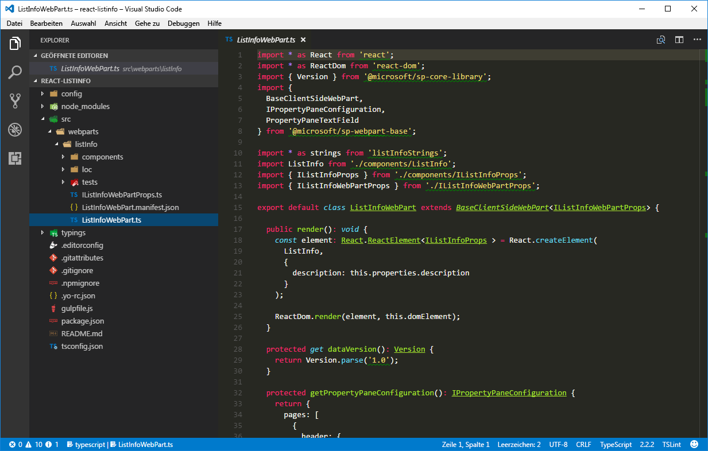
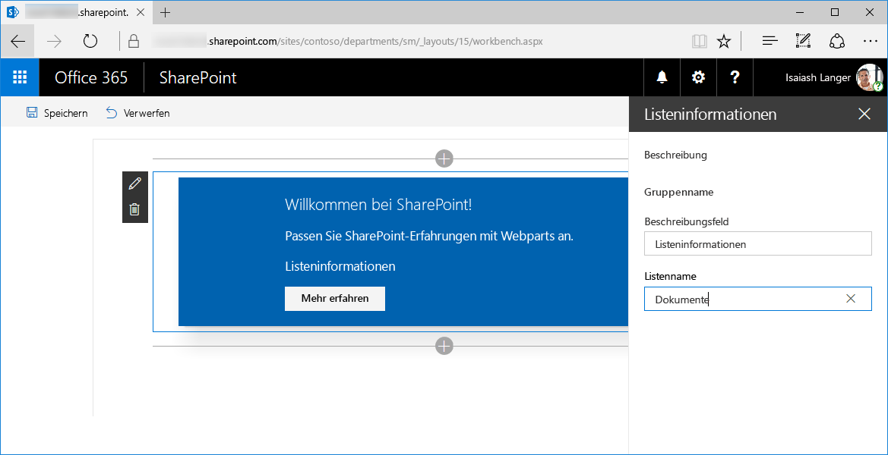
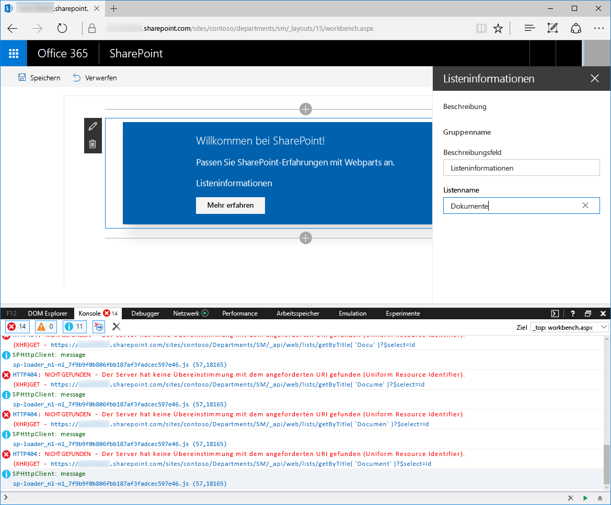

# <a name="validate-web-part-property-values"></a>Überprüfen von Webpart-Eigenschaftswerten

Wenn Sie mit clientseitigen SharePoint-Framework-Webparts arbeiten, können Benutzer diese mithilfe der Eigenschaften entsprechend der jeweiligen Bedürfnisse konfigurieren. Überprüfen Sie die bereitgestellten Konfigurationswerte und erleichtern Sie es Benutzern auf diese Weise, den Webpart zu konfigurieren und das Arbeiten mit dem Webpart insgesamt zu verbessern. 

> [!NOTE] 
> Bevor Sie die Schritte in diesem Artikel durchführen, müssen Sie [eine Entwicklungsumgebung einrichten](../../set-up-your-development-environment.md), in der Sie SharePoint-Framework-Lösungen erstellen können.

## <a name="create-a-new-web-part-project"></a>Erstellen eines neuen Webpart-Projekts

1. Erstellen Sie zunächst einen neuen Ordner für Ihr Projekt.

  ```sh
  md react-listinfo
  ```

2. Wechseln Sie zum Projektordner.

  ```sh
  cd react-listinfo
  ```

3. Führen Sie im Projektordner den SharePoint Framework-Yeoman-Generator aus, um ein Gerüst für ein neues SharePoint-Framework-Projekt zu erstellen:

  ```sh
  yo @microsoft/sharepoint
  ```

4. Geben Sie die folgenden Werte ein, wenn Sie dazu aufgefordert werden:

  - **react-listinfo** als Name der Lösung
  - **Use the current folder** als Speicherort für die Dateien
  - **React** als Startpunkt für die Webparterstellung
  - **List Info** als Namen des Webparts
  - **Shows information about the selected list** als Beschreibung Ihres Webparts

  

5. Sobald das Gerüst abgeschlossen ist, sperren Sie die Version der Projektabhängigkeiten, indem Sie den folgenden Befehl ausführen:

  ```sh
  npm shrinkwrap
  ```

6. Öffnen Sie den Projektordner im Code-Editor. In diesem Artikel wird Visual Studio Code in den Schritten und Screenshots verwendet, Sie können jedoch einen beliebigen Editor verwenden.

  

<br/>

## <a name="options-for-validating-web-part-properties"></a>Optionen zum Überprüfen von Webparteigenschaften

SharePoint Framework bietet Entwicklern zwei Methoden zum Überprüfen der Werte von Webpart-Eigenschaften. Sie können den Wert direkt innerhalb des Webpart-Codes überprüfen oder eine externe API zum Durchführen der Überprüfung aufrufen. 

Die Inline-Überprüfung eignet sich zur Durchführung einfacher Überprüfungen wie z. B. auf minimale/maximale Länge, erforderliche Eigenschaften oder zur Erkennung einfacher Muster, wie z. B. Postleitzahlen. Bei auf Geschäftslogik basierenden Überprüfungen, z. B. der Sozialversicherungsnummer oder Mitgliedschaft in Sicherheitsgruppen, ist das Aufrufen externer APIs der bessere Ansatz.

Um den Wert einer Webpart-Eigenschaft zu überprüfen, müssen Sie den Ereignishandler für das Ereignis **onGetErrorMessage** der jeweiligen Eigenschaft implementieren. Bei der Inline-Überprüfung sollte der Ereignishandler eine Zeichenfolge mit dem Fehler oder eine leere Zeichenfolge zurückgeben, wenn der angegebene Wert gültig ist. 

Für die Überprüfung mithilfe von Remote-APIs gibt der Ereignishandler eine Zusage der Zeichenfolge zurück. Wenn der angegebene Wert ungültig ist, wird die Zusage mit der Fehlermeldung aufgelöst. Ist der angegebene Wert gültig, wird die Zusage mit einer leeren Zeichenfolge aufgelöst.

## <a name="validate-web-part-property-values-inline"></a>Inline-Überprüfung von Webpart-Eigenschaftswerten

In diesem Schritt überprüfen Sie, dass die Webpart-Eigenschaft einer Beschreibung angegeben ist und ihr Wert nicht mehr als 40 Zeichen beträgt. Dazu verwenden Sie das Inline-Überprüfungsverfahren.

1. Öffnen Sie im Code-Editor die Datei **./src/webparts/listInfo/ListInfoWebPart.ts**. Fügen Sie in der Klasse **ListInfoWebPart** die Methode **validateDescription** mit dem folgenden Code hinzu:

  ```ts
  export default class ListInfoWebPart extends BaseClientSideWebPart<IListInfoWebPartProps> {
    // ...

    private validateDescription(value: string): string {
      if (value === null ||
        value.trim().length === 0) {
        return 'Provide a description';
      }

      if (value.length > 40) {
        return 'Description should not be longer than 40 characters';
      }

      return '';
    }
  }
  ```

  Mit der Methode **validateDescription** wird überprüft, ob die Beschreibung angegeben wurde und 40 Zeichen nicht überschreitet. Ist die bereitgestellte Beschreibung ungültig, gibt die Methode eine Fehlermeldung zurück, die dem Überprüfungsfehler entspricht. Ist der angegebene Wert korrekt, wird eine leere Zeichenfolge zurückgegeben.

2. Ordnen Sie die Methode **validateDescription** der Webpart-Eigenschaft **description** zu. Ändern Sie in der Klasse **ListInfoWebPart** die Implementierung der Methode **getPropertyPaneConfiguration** in:

  ```ts
  export default class ListInfoWebPart extends BaseClientSideWebPart<IListInfoWebPartProps> {
    // ...

    protected getPropertyPaneConfiguration(): IPropertyPaneConfiguration {
      return {
        pages: [
          {
            header: {
              description: strings.PropertyPaneDescription
            },
            groups: [
              {
                groupName: strings.BasicGroupName,
                groupFields: [
                  PropertyPaneTextField('description', {
                    label: strings.DescriptionFieldLabel,
                    onGetErrorMessage: this.validateDescription.bind(this)
                  })
                ]
              }
            ]
          }
        ]
      };
    }

    // ...
  }
  ```

  Sie haben die Definition des Webparts **description** durch Definieren der Methode **validateDescription** als Ereignishandler für das Ereignis **onGetErrorMessage** erweitert.

3. Führen Sie den folgenden Befehl aus, um das Ergebnis der Überprüfung zu sehen:

  ```sh
  gulp serve
  ```

4. Fügen Sie in der Workbench den Webpart zum Zeichenbereich hinzu und öffnen Sie dessen Eigenschaften. Wenn Sie die Beschreibung entfernen, sollte der erste Fehler angezeigt werden.

  

5. Geben Sie einen Wert an, der länger als 40 Zeichen ist. Unterhalb des Textfelds sollte ein weiterer Überprüfungsfehler angezeigt werden.

  

6. Beachten Sie, dass bei Angabe eines ungültigen Werts der Webpart mit dem letzten gültigen Wert gerendert wird. Darüber hinaus wird im nichtreaktiven Modus des Eigenschaftenbereichs bei Ungültigkeit einer Webpart-Eigenschaft die Schaltfläche **Apply** deaktiviert, damit die ungültige Konfiguration nicht vom Benutzer angewendet werden kann.

  

## <a name="validate-web-part-property-values-using-remote-apis"></a>Überprüfung von Webpart-Eigenschaftswerten mithilfe von Remote-APIs

In einigen Szenarien kann das Überprüfen von Webpart-Eigenschaftswerten komplexer sein und möglicherweise eine bestimmte Geschäftslogik erfordern. In solchen Fällen kann es effizienter sein, den Wert mit einer vorhandenen API zu überprüfen, anstatt die Geschäftslogik im Webpart zu implementieren und aufrechtzuerhalten.

In diesem Schritt implementieren Sie eine Validierungslogik, die überprüft, ob die Liste mit dem in den Webpart-Eigenschaften angegebenen Namen auf der aktuellen SharePoint-Website vorhanden ist.

### <a name="add-the-listname-web-part-property"></a>Hinzufügen der Webpart-Eigenschaft listName

1. Öffnen Sie im Code-Editor die Datei **./src/webparts/listInfo/ListInfoWebPart.manifest.json**. Fügen Sie in der Eigenschaft **properties** eine neue Eigenschaft mit dem Namen **listName** hinzu, deren Standardwert auf eine leere Zeichenfolge festgelegt ist:

  ```json
  {
    "$schema": "https://dev.office.com/json-schemas/spfx/client-side-web-part-manifest.schema.json",
    "id": "1ec8f92d-ea55-4584-bf50-bac435c916bf",
    "alias": "ListInfoWebPart",
    "componentType": "WebPart",

    // The "*" signifies that the version should be taken from the package.json
    "version": "*",
    "manifestVersion": 2,

    // If true, the component can only be installed on sites where Custom Script is allowed.
    // Components that allow authors to embed arbitrary script code should set this to true.
    // https://support.office.com/en-us/article/Turn-scripting-capabilities-on-or-off-1f2c515f-5d7e-448a-9fd7-835da935584f
    "requiresCustomScript": false,

    "preconfiguredEntries": [{
      "groupId": "1ec8f92d-ea55-4584-bf50-bac435c916bf",
      "group": { "default": "Under Development" },
      "title": { "default": "List info" },
      "description": { "default": "Shows information about the selected list" },
      "officeFabricIconFontName": "Page",
      "properties": {
        "description": "List info"
      }
    }]
  }
  ```

2. Öffnen Sie im Code-Editor die Datei **./src/webparts/listInfo/IListInfoWebPartProps.ts** und erweitern Sie die Schnittstellendefinition mit der Typzeichenfolgen-Eigenschaft **listName**.

  ```ts
  export interface IListInfoWebPartProps {
    description: string;
    listName: string;
  }
```

3. Fügen Sie als Letztes die neue Webpart-Eigenschaft hinzu, indem Sie die Datei **./src/webparts/listInfo/ListInfoWebPart.ts** im Code-Editor öffnen und die Implementation der Methode **getPropertyPaneConfiguration** wie folgt ändern:

  ```ts
  export default class ListInfoWebPart extends BaseClientSideWebPart<IListInfoWebPartProps> {
    // ...

    protected getPropertyPaneConfiguration(): IPropertyPaneConfiguration {
      return {
        pages: [
          {
            header: {
              description: strings.PropertyPaneDescription
            },
            groups: [
              {
                groupName: strings.BasicGroupName,
                groupFields: [
                  PropertyPaneTextField('description', {
                    label: strings.DescriptionFieldLabel,
                    onGetErrorMessage: this.validateDescription.bind(this)
                  }),
                  PropertyPaneTextField('listName', {
                    label: strings.ListNameFieldLabel
                  })
                ]
              }
            ]
          }
        ]
      };
    }

    // ...
  }
  ```

4. Fügen Sie die fehlende Ressourcenzeichenfolge **ListNameFieldLabel** hinzu, indem Sie den Code der Datei **./src/webparts/listInfo/loc/mystrings.d.ts** wie folgt ändern:

  ```ts
  declare interface IListInfoStrings {
    PropertyPaneDescription: string;
    BasicGroupName: string;
    DescriptionFieldLabel: string;
    ListNameFieldLabel: string;
  }

  declare module 'listInfoStrings' {
    const strings: IListInfoStrings;
    export = strings;
  }
  ```

5. Ändern Sie den Code der Datei **./src/webparts/listInfo/loc/en-us.js** in:

  ```js
  define([], function() {
    return {
      "PropertyPaneDescription": "Description",
      "BasicGroupName": "Group Name",
      "DescriptionFieldLabel": "Description Field",
      "ListNameFieldLabel": "List name"
    }
  });
  ```

6. Führen Sie den folgenden Befehl aus, um zu überprüfen, ob das Projekt ausgeführt wird und die neu hinzugefügte Listennameneigenschaft im Eigenschaftenbereich des Webparts angezeigt wird:

  ```sh
  gulp serve
  ```

  <br/>

  

### <a name="validate-the-name-of-the-list-by-using-the-sharepoint-rest-api"></a>Überprüfen des Listennamens mithilfe der SharePoint REST-API

In diesem Schritt überprüfen Sie den angegebenen Namen der Liste und prüfen, ob dieser einer vorhandenen Liste auf der aktuellen SharePoint-Website entspricht.

1. Öffnen Sie im Code-Editor die Datei **./src/webparts/listInfo/ListInfoWebPart.ts** und fügen Sie die folgenden Referenzen hinzu:

  ```ts
  import { SPHttpClient, SPHttpClientResponse } from '@microsoft/sp-http';
  import { escape } from '@microsoft/sp-lodash-subset';
  ```

2. Fügen Sie in der Klasse **ListInfoWebPart** die Methode **validateListName** mit dem folgenden Code hinzu:

  ```ts
  export default class ListInfoWebPart extends BaseClientSideWebPart<IListInfoWebPartProps> {
    // ...

    private validateListName(value: string): Promise<string> {
      return new Promise<string>((resolve: (validationErrorMessage: string) => void, reject: (error: any) => void): void => {
        if (value === null ||
          value.length === 0) {
          resolve('Provide the list name');
          return;
        }

        this.context.spHttpClient.get(this.context.pageContext.web.absoluteUrl + `/_api/web/lists/getByTitle('${escape(value)}')?$select=Id`, SPHttpClient.configurations.v1)
          .then((response: SPHttpClientResponse): void => {
            if (response.ok) {
              resolve('');
              return;
            }
            else if (response.status === 404) {
              resolve(`List '${escape(value)}' doesn't exist in the current site`);
              return;
            }
            else {
              resolve(`Error: ${response.statusText}. Please try again`);
              return;
            }
          })
          .catch((error: any): void => {
            resolve(error);
          });
      });
    }
  }
  ```

  Zuerst überprüft die Methode **validateListName**, ob ein Listenname bereitgestellt wurde. Wenn dies nicht der Fall ist, wird die Zusage mit dem entsprechenden Überprüfungsfehler aufgelöst. Hat der Benutzer einen Listennamen angegeben, verwendet die Methode **validateListName** den **SPHttpClient**, um die SharePoint REST-API aufzurufen und zu überprüfen, ob eine Liste mit diesem Namen existiert.

  Wenn die Liste mit dem angegebenen Namen auf der aktuellen Website vorhanden ist, wird der Statuscode „200 OK“ zurückgegeben und die Methode **validateListName** löst die Zusage mit einer leeren Zeichenfolge auf, die bestätigt, dass der angegebene Wert eine gültige Liste darstellt. 
  
  Ist die Liste mit dem angegebenen Namen nicht vorhanden, wird als Antwort ein anderer Code zurückgegeben. In der Regel lautet die Antwort „404 Not Found“; es kann jedoch auch ein anderer Statuscode zurückgegeben werden, wenn bei der Anforderung auf andere Weise ein Fehler aufgetreten ist. In beiden Fällen zeigt die Methode **validateListName** dem Benutzer die entsprechende Fehlermeldung an.

  Nach dem Definieren der Überprüfungsmethode für den Listennamen wird diese im nächsten Schritt als Validierungshandler für die Webpart-Eigenschaft **listName** konfiguriert. 
  
3. Ersetzen Sie in der Klasse **ListInfoWebPart** den Code der Methode **getPropertyPaneConfiguration** durch:

  ```ts
  export default class ListInfoWebPart extends BaseClientSideWebPart<IListInfoWebPartProps> {
    // ...

    protected getPropertyPaneConfiguration(): IPropertyPaneConfiguration {
      return {
        pages: [
          {
            header: {
              description: strings.PropertyPaneDescription
            },
            groups: [
              {
                groupName: strings.BasicGroupName,
                groupFields: [
                  PropertyPaneTextField('description', {
                    label: strings.DescriptionFieldLabel,
                    onGetErrorMessage: this.validateDescription.bind(this)
                  }),
                  PropertyPaneTextField('listName', {
                    label: strings.ListNameFieldLabel,
                    onGetErrorMessage: this.validateListName.bind(this)
                  })
                ]
              }
            ]
          }
        ]
      };
    }

    // ...
  }
  ```

4. Führen Sie den folgenden Befehl aus, um das Ergebnis der Überprüfung zu sehen:

  ```sh
  gulp serve --nobrowser
  ```

  Da die Listennamen-Überprüfungsmethode mit der SharePoint REST-API kommuniziert, müssen Sie den Webpart in der gehosteten Version der SharePoint-Workbench testen.

5. Fügen Sie den Webpart zum Zeichenbereich hinzu und öffnen Sie dessen Eigenschaften. Da Sie keinen Standardwert für den Listennamen angegeben haben, dies aber eine erforderliche Eigenschaft ist, wird Ihnen ein Überprüfungsfehler angezeigt.

  

  <br/>

  Wenn Sie einen nicht vorhandenen Listennamen angeben, zeigt der Webpart einen Überprüfungsfehler an, der besagt, dass die angegebene Liste auf der aktuellen Website nicht vorhanden ist.

  

  <br/>

  Wenn Sie den Namen einer vorhandenen Liste angeben, wird der Validierungsfehler ausgeblendet.

  

### <a name="optimize-validation-using-remote-apis"></a>Optimieren der Überprüfung mithilfe von Remote-APIs

Beim Überprüfen von Webpart-Eigenschaften mit Remote-APIs überwacht SharePoint Framework Änderungen an den Steuerelementen des Eigenschaftenbereichs und sendet die aktualisierten Werte zur Überprüfung an den angegebenen Überprüfungshandler. Standardmäßig wartet SharePoint Framework 200 ms, bevor das Überprüfungsverfahren ausgelöst wird. Wenn der Benutzer den Wert von 200 ms nicht geändert hat, wird das Überprüfungsverfahren von SharePoint Framework gestartet. Wenn der Überprüfungshandler eine Remote-API verwendet, sendet diese Methode bei jedem Start des Überprüfungsverfahrens eine Webanforderung an die API, um den angegebenen Wert zu überprüfen. Schreibt der Benutzer nicht schnell genug, werden nur teilweise fertiggestellte Werte zur Überprüfung gesendet, was eine unnötige Belastung für das Netzwerk und die API darstellt. In solchen Fällen sollten Sie die Verzögerung der Überprüfung erhöhen.



Sie können die Überprüfungsverzögerung für jede Eigenschaft separat konfigurieren, je nach dem Typ des Werts, den der Benutzer angeben muss. 

#### <a name="to-increase-the-validation-delay-for-the-listname-property"></a>Erhöhen der Überprüfungsverzögerung für die listName-Eigenschaft

1. Öffnen Sie im Code-Editor die Datei **./src/webparts/listInfo/ListInfoWebPart.ts**. Ändern Sie den Code der Methode **getPropertyPaneConfiguration** in:

  ```ts
  export default class ListInfoWebPart extends BaseClientSideWebPart<IListInfoWebPartProps> {
    // ...

    protected getPropertyPaneConfiguration(): IPropertyPaneConfiguration {
      return {
        pages: [
          {
            header: {
              description: strings.PropertyPaneDescription
            },
            groups: [
              {
                groupName: strings.BasicGroupName,
                groupFields: [
                  PropertyPaneTextField('description', {
                    label: strings.DescriptionFieldLabel,
                    onGetErrorMessage: this.validateDescription.bind(this)
                  }),
                  PropertyPaneTextField('listName', {
                    label: strings.ListNameFieldLabel,
                    onGetErrorMessage: this.validateListName.bind(this),
                    deferredValidationTime: 500
                  })
                ]
              }
            ]
          }
        ]
      };
    }

    // ...
  }

  ```

2. Die Eigenschaft **deferredValidationTime** gibt die Anzahl Millisekunden an, die das SharePoint Framework abwartet, bevor es den Überprüfungsprozess startet.

3. Überprüfen Sie mit dem folgenden Befehl, ob die angewandte Verzögerung wie erwartet funktioniert:

  ```sh
  gulp serve --nobrowser
  ```
